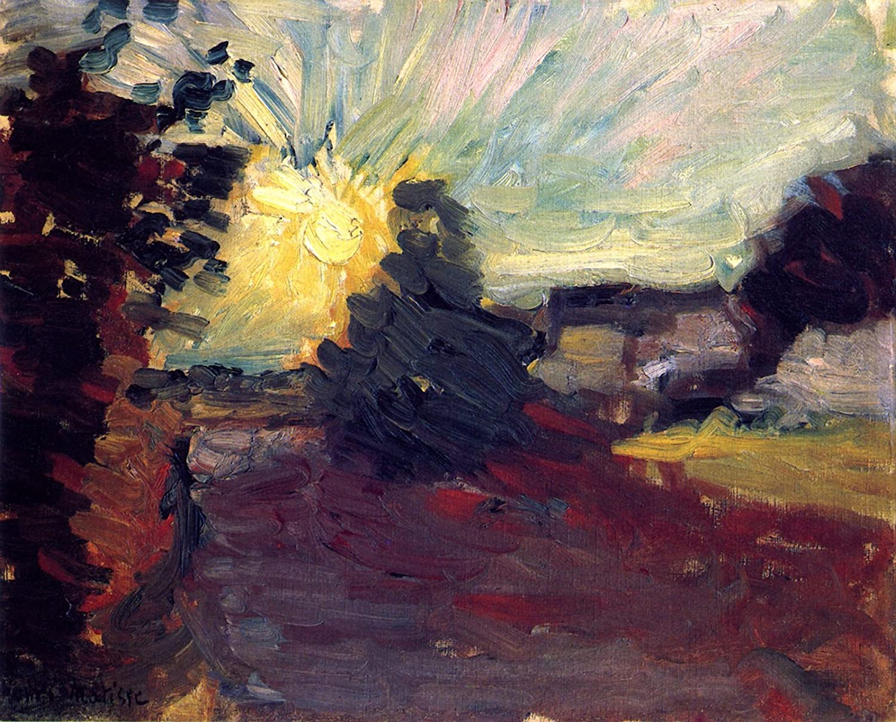

## 基本信息

- 作者：[[马蒂斯 Henri Matisse]]
- 创作年代：1898
- 材质：油彩，画布 (*not from wiki*)
- 现存地：(*not from wiki*)

## 画面与技法

[[马蒂斯 Henri Matisse]] **凡·高影响期代表作**（060 明示）—— 通过 [[毕沙罗 Camille Pissarro]] 接触到 [[凡·高 Vincent van Gogh]] 作品后画的本作，**奔放的笔触、厚涂的颜料和鲜艳的色彩**显然都是受了凡·高的影响。

但 060 强调：**"与塞尚相比，凡·高对马蒂斯产生的影响要小很多。"** —— 凡·高的厚涂、运笔狂放被马蒂斯吸收，但马蒂斯的核心结构始终是塞尚的颜色塑形/分节体系。

## 历史背景 (*not from wiki*)

1898 年马蒂斯偕妻子前往 Corse（科西嘉岛）和 Toulouse 度蜜月与休养，绘制了多幅地中海主题风景画。

## 图片清单

| 编号 | 出自 | 描述 |
|---|---|---|
| 01 | [[060｜马蒂斯1：野兽派从何而来？]] | 全图——凡·高式厚涂奔放 |

## 出现在

- [[060｜马蒂斯1：野兽派从何而来？]]
