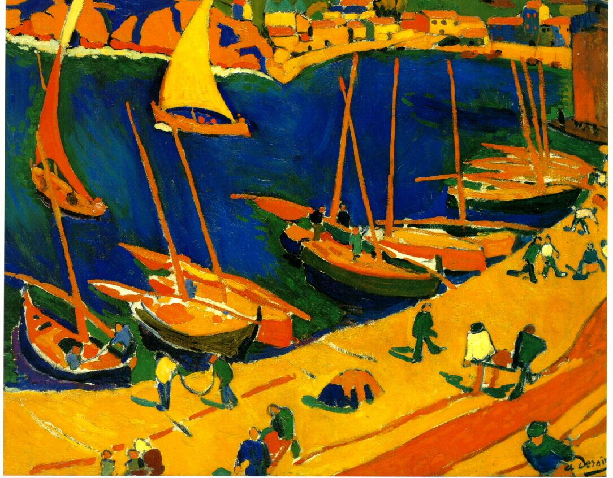

## 基本信息

- 作者：[[德朗 André Derain]]
- 创作年代：1905
- 材质：油彩，画布 (*not from wiki*)
- 现存地：(*not from wiki*)

## 画面与技法

[[野兽派 Fauvism]] 1905 [[秋季沙龙展 Salon d'Automne|秋季沙龙]] 第七展室作品。南法 Collioure 渔港主题，**颜色非常鲜艳、运笔狂放**——粉色房屋、橙黄海面、纯色对比。1905 年夏，[[德朗 André Derain]] 与 [[马蒂斯 Henri Matisse]] 共同在 Collioure 度夏写生，是野兽派色彩美学的关键孕育地。

## 历史背景 (*not from wiki*)

Collioure 位于法国与西班牙交界的地中海沿岸，色彩饱和、光线强烈，与[[印象派 Impressionism]] 的诺曼底灰湿光形成强烈对照。德朗、马蒂斯在此期间互相影响、形成野兽派标志性的"南法纯色"美学。本作展于 1905 秋季沙龙第七展室。

## 图片清单

| 编号 | 出自 | 描述 |
|---|---|---|
| 01 | [[060｜马蒂斯1：野兽派从何而来？]] | 全图——1905 秋季沙龙作品 |

## 出现在

- [[060｜马蒂斯1：野兽派从何而来？]]
