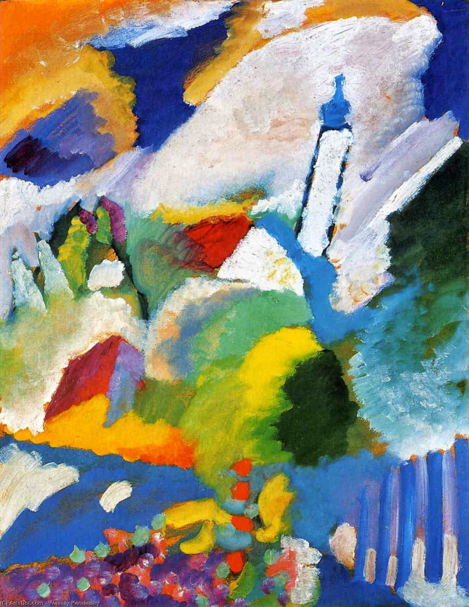

## 基本信息

- 作者：[[康定斯基 Wassily Kandinsky]]
- 创作年代：1910
- 材质：布面油画 (*not from wiki*)
- 尺寸：(*not from wiki*)
- 现存地：(*not from wiki*)

## 画面与技法

顾衡 082 用此画与 1911 年的《[[抒情诗 Lyrical]]》一起作为康定斯基**渐进抽象**的证据：看似随意勾勒线条、涂抹色彩，但**教堂的尖塔等具象成分仍清晰可辨**。

## 历史背景 (*not from wiki*)

巴伐利亚 Murnau 小镇是康定斯基 1909–1914 年的主要创作据点。他在此完成的多幅《Murnau》题材作品，被视为他从野兽派 / [[青骑士 Der Blaue Reiter]] 风格向抽象过渡的"中间形态"。

## 图片清单

| 编号 | 出自 | 描述 |
|---|---|---|
| 01 | [[082｜康定斯基2：他为什么走向抽象？]] | 教堂尖塔仍清晰可辨 |

## 出现在

- [[082｜康定斯基2：他为什么走向抽象？]]
