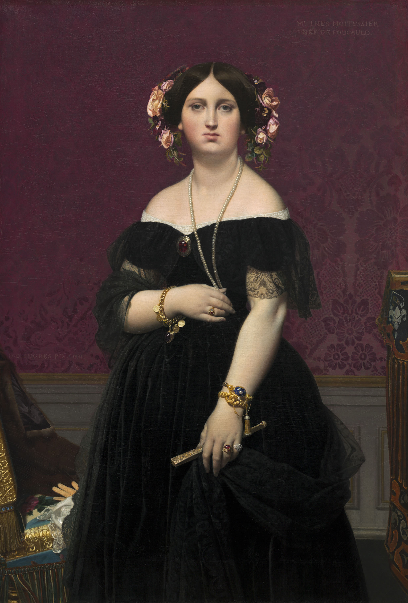

## 基本信息

- 作者：[[安格尔 Jean-Auguste-Dominique Ingres]]
- 创作年代：1851
- 材质：布面油画 (*not from wiki*)
- 尺寸：147 × 100 cm (*not from wiki*)
- 现存地：(*not from wiki*) 华盛顿国家美术馆 (National Gallery of Art, Washington)

## 画面与技法

穆瓦特西埃夫人立姿——身着深色礼服、佩戴项链与手镯、左手轻持手套。**正面对观者**（区别于 [[穆瓦特西埃夫人像 (坐) Portrait of Madame Moitessier (Seated)]] 1856 的坐姿微侧）。

立姿版**先完成于 1851**，坐姿版**完成于 1856**——两幅成对、视为同一模特"立 + 坐"双面像。

## 历史背景

(*not from wiki*) 模特穆瓦特西埃夫人 (Inès Moitessier) 是当时**巴黎最红的名媛**、被誉为"巴黎最美的女人"——其夫为银行家。安格尔为其先后画了两幅（立像 1851 + 坐像 1856），耗时**总计 7 年以上**。顾衡 032：

> "如果没有强烈的爱慕之情，怎么可能让早已功成名就的安格尔盯着一个女人画七年呢？"

## 图片清单

| 编号 | 出自 | 描述 |
|---|---|---|
| 01 | [[032｜安格尔：为什么他是学院派最后一位大师？]] | 整体画面 |

## 出现在

- [[032｜安格尔：为什么他是学院派最后一位大师？]]
