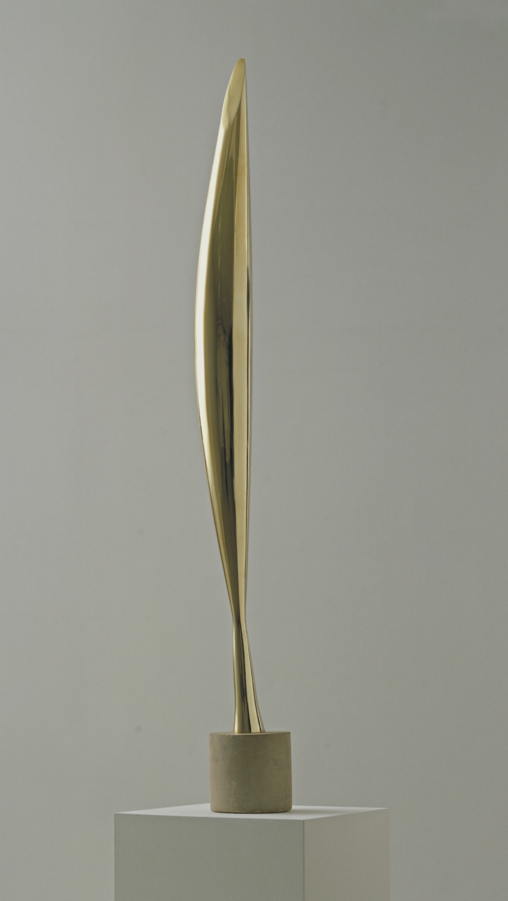

## 基本信息

- 作者：[[布朗库西 Constantin Brâncuși]]
- 创作年代：1928（第一版；系列从 1923 起约 27 件） (*not from wiki*)
- 材质：抛光青铜 / 大理石（多版本） (*not from wiki*)
- 尺寸：约 134 cm 高 (*not from wiki*)
- 现存地：纽约现代艺术博物馆 MoMA 等 (*not from wiki*)

## 画面与技法

[[布朗库西 Constantin Brâncuși]] **最著名的雕塑系列**之一。题为"鸟"，却把鸟身**所有可识别细节全部抹除**——只剩一根抛光、向上拔起、略带扭转的金属流线。

顾衡 078 解读：

> 《空间的鸟》，表现的就是柏拉图说的**原型**。而具象的[[麦雅斯特拉 (布朗库西) Maiastra]]，则是柏拉图所说的**摹仿**。这两件雕塑，就是这一对概念最直观的表达。

雕塑不再表现"鸟的形状"，而表现"**飞翔本身**"——抓住"鸟之所以为鸟"的本质（向上、流线、轻盈），剥离一切偶然属性。

这种"对原型 / 纯粹形式美的追求"直接传染给 [[莫迪里阿尼 Amedeo Modigliani]]——莫迪里阿尼标志性的过长鼻子就是这一思路的二维平面应用（078）。

## 历史背景 (*not from wiki*)

1926 年布朗库西携《Bird in Space》入境美国时，美国海关拒绝承认它是"艺术品"、按"金属原料"征税——引发著名的 *Brancusi v. United States* (1928) 案，最终法院判定它属艺术品。这是 20 世纪法律史上对"什么是艺术"的关键判例。

## 图片清单

| 编号 | 出自 | 描述 |
|---|---|---|
| 01 | [[078｜莫迪里阿尼：画中女子为什么让人一眼难忘？]] | 抛光青铜流线（第一版） |

## 出现在

- [[078｜莫迪里阿尼：画中女子为什么让人一眼难忘？]]
