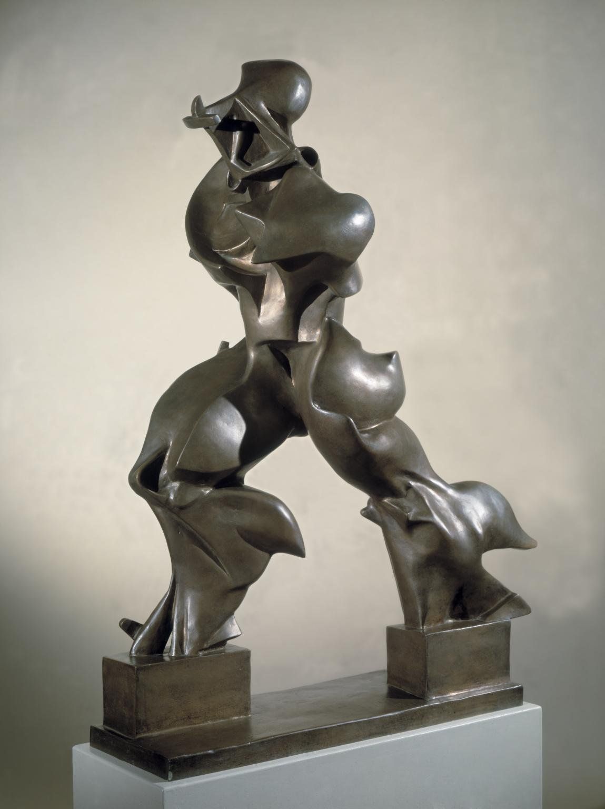

## 基本信息

- 作者：[[波丘尼 Umberto Boccioni]]
- 创作年代：1913
- 材质：青铜（原作为石膏 1913，后铸为青铜）(*not from wiki*)
- 尺寸：111.2 × 88.5 × 40 cm (*not from wiki*)
- 现存地：多版铜铸——纽约 MoMA、米兰当代美术馆 (Museo del Novecento) 等 (*not from wiki*)

## 画面与技法

[[波丘尼 Umberto Boccioni]] 最重要的雕塑作品——**唯一的雕塑形体把"运动" + "速度" + "机器感"在三维空间里固化**。一个高速行进的人形被风、力、空气撕扯出连续的肌肉/盔甲褶皱。

## 历史背景

(*not from wiki*) 1913 年原石膏作品在米兰展出。波丘尼 1916 年战死后，此作成为他在 [[未来主义 Futurism]] 雕塑领域唯一最具标志性的遗产。意大利欧元 20 分硬币背面即此雕塑——可见其在意大利国族文化中的地位。

## 图片清单

| 编号 | 出自 | 描述 |
|---|---|---|
| 01 | [[080｜什么是未来主义？]] | 整体图（青铜版本） |

## 出现在

- [[080｜什么是未来主义？]]
