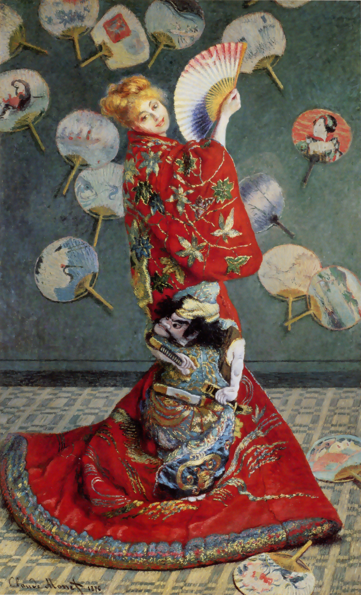

## 基本信息

- 作者：[[莫奈 Claude Monet]]
- 创作年代：1876
- 材质：布面油画 (*not from wiki*)
- 尺寸：231.8 × 142.3 cm (*not from wiki*)
- 现存地：波士顿美术馆 Museum of Fine Arts, Boston (*not from wiki*)

## 画面与技法

模特是莫奈妻子 [[卡美伊·东西厄 Camille Doncieux]]，戴金色假发、身着大红绣金武士图案的歌舞伎和服、左手持折扇——背景墙面布满日本团扇——是 1870s 中后期欧洲 [[中国风 Chinoiserie]] / 日本主义 Japonisme 浪潮下的标本作品。

043 顾衡定位它为"莫奈的妥协之作"——1876 年第二届印象派画展受 [[雷诺阿 Pierre-Auguste Renoir]] 上届《[[包厢 The Theatre Box]]》启发，莫奈也画一幅迎合画作，**卖了 2000 法郎暂解燃眉之急**。

## 历史背景 (*not from wiki*)

1876 年第二届印象派画展展出。画风一反莫奈惯常的户外光线主题，转而向布尔乔亚客户的"日本趣味"靠拢——这种为生计而妥协的策略，被 043 与雷诺阿《[[包厢 The Theatre Box]]》并列为印象派内部"硬抗 vs 圆融"两种生存路线的代表。

## 图片清单

| 编号 | 出自 | 描述 |
|---|---|---|
| 01 | [[043｜雷诺阿：妥协如何造就大师？]] | 全图，穿和服的卡美伊 |

## 出现在

- [[043｜雷诺阿：妥协如何造就大师？]]
