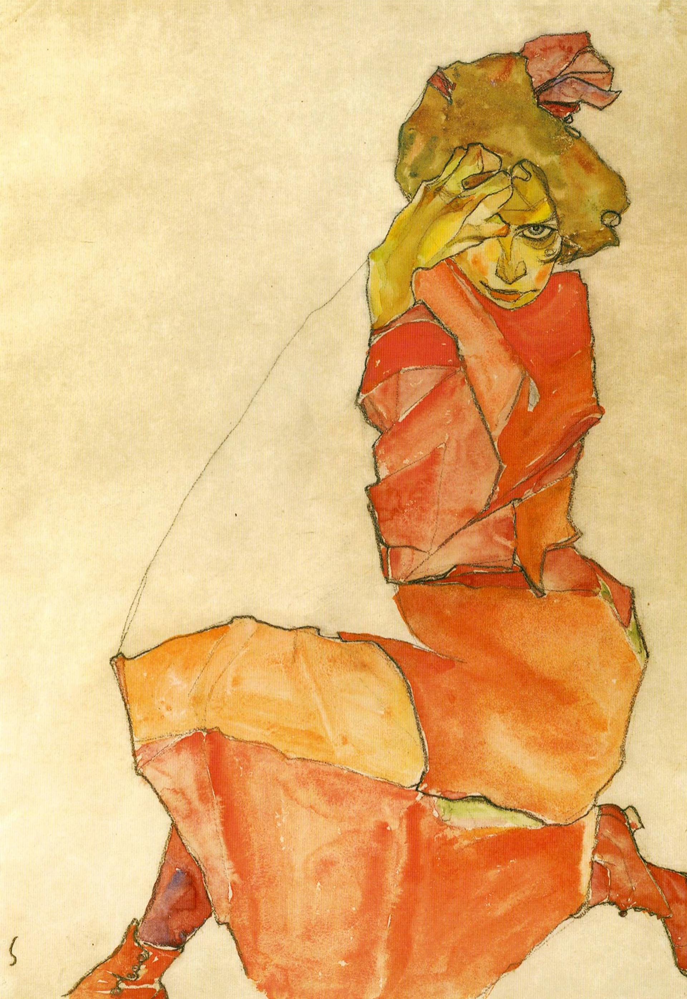

## 基本信息

- **作者**：[[席勒 Egon Schiele]]
- **创作年代**：1910
- **材质**：水彩 / 纸 (*not from wiki*)
- **现存地**：私人收藏 (*not from wiki*)

## 画面与技法

席勒**对精神分析学说的直接诠释**之代表（顾衡 075）：为了表现人的焦虑，席勒曾**特意跑到精神病院观察病人的动作和神态**——重度焦虑的人**多半不是个胖子**——所以席勒笔下的人物总是**瘦长的和紧张的**。

画面中女子身体扭曲、四肢绷紧、神情警觉——是席勒以图像翻译 [[弗洛伊德 Sigmund Freud]] **神经官能症**症状分类的早期代表。

## 历史背景 (*not from wiki*)

席勒此时正受到精神分析学说与维也纳分离派审美的双重塑形，且尚未因 1912 年的诱拐案件入狱。

## 图片清单

| 编号 | 出自 | 描述 |
|---|---|---|
| 01 | [[075｜席勒2：为什么他是"最表现主义"的画家？]] | 全身 |

## 出现在

- [[075｜席勒2：为什么他是"最表现主义"的画家？]]
