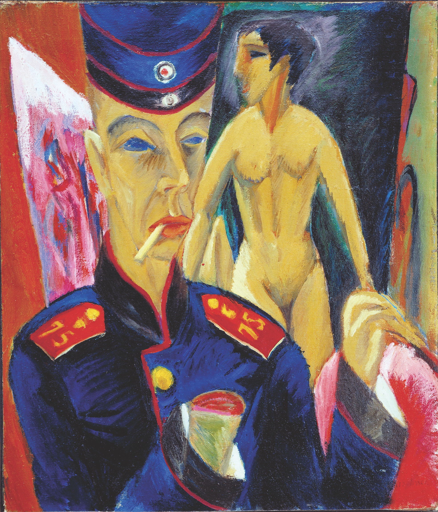

## 基本信息

- **作者**：[[基希纳 Ernst Ludwig Kirchner]]
- **创作年代**：1915
- **材质**：布面油画 (*not from wiki*)
- **尺寸**：69 × 61 cm (*not from wiki*)
- **现存地**：俄亥俄州奥伯林学院艾伦纪念艺术博物馆 Allen Memorial Art Museum, Oberlin (*not from wiki*)

## 画面与技法

- **创作动机**：一战爆发后基希纳应征入伍，因战争残酷迅速精神崩溃——这幅画就是当时**颓废和幻灭精神状态**的画面化。
- **画面细节**：
  - **面部表情僵硬**
  - **眼神空洞**
  - **断掉的右手**露出"火腿一样的切面"——画家的"持画之手"被战争截断
- **批评话语**：072 引 [[赫尔曼·巴尔 Hermann Bahr]] 一段话——"从未有一个时代如此被恐惧动摇……艺术也是，哭着进入底层与黑暗之中，哭着求助……"——为这幅画提供了**最贴切的诠释**。

## 历史背景 (*not from wiki*)

实际上基希纳的手并未在战争中受伤——画面中的截肢是**心理状态的视觉外化**，象征艺术家创作能力被战争摧毁。

## 图片清单

| 编号 | 出自 | 描述 |
|---|---|---|
| 01 | [[072｜桥社：什么是表现主义绘画的使命？]] | Self-Portrait as a Soldier 1915 — 断手、空洞眼神 |

## 出现在

- [[072｜桥社：什么是表现主义绘画的使命？]]
