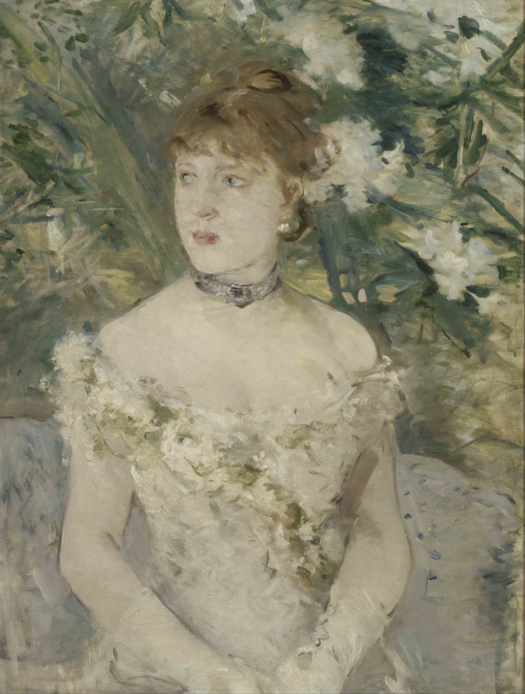

## 基本信息

- 作者：[[莫利索 Berthe Morisot]]
- 创作年代：1879
- 材质：布面油画 (*not from wiki*)
- 尺寸：71 × 54 cm (*not from wiki*)
- 现存地：巴黎奥赛博物馆 Musée d'Orsay (*not from wiki*)

## 画面与技法（顾衡 044 解读）

[[莫利索 Berthe Morisot]] 的代表作——一位当时著名的演员**侧头**而立、像在等什么人，或者一辆马车。**背景的花丛和人物衣服的颜色浑然一体**——树上的花就像戴在人物头上一样。

顾衡 044 解读两条：

1. **对三维空间极度压缩**——背景与人物贴合到几乎二维——"应该是受了 [[马奈 Édouard Manet]] 的影响"（参见 [[阳台 The Balcony]] 的"压扁的景深"）；
2. **印象派绘画中最美最成功的面庞**——"我们稍微离画面远一点儿，立即就能看到一张非常漂亮和无比真实的面庞，同时又仍然保留了小笔触构图所特有的生动。**这才是印象派的初衷啊！**"

## 在课程中的角色

**顾衡 044 个人最爱的莫利索作品**——课程明文："**在莫利索所有的作品中，我最喜欢的就是这幅《穿着盛装的年轻女人》。**" 044 用它作为印象派"既马赛克化又保留生动"双重目标的**最高完成度样本**。

## 历史背景 (*not from wiki*)

模特身份至今仍有不同说法（多被认为是当时的一位女演员）。1880 年第五届印象派画展展出。

## 图片清单

| 编号 | 出自 | 描述 |
|---|---|---|
| 01 | [[044｜莫利索和毕沙罗：最纯正的印象派什么样？]] | 全画，侧头而立的演员 |

## 出现在

- [[044｜莫利索和毕沙罗：最纯正的印象派什么样？]] —— 顾衡个人最爱的莫利索作品
- [[莫利索 Berthe Morisot]] —— 代表作首选
- [[印象派 Impressionism]] —— "最美最成功的面庞"样本
