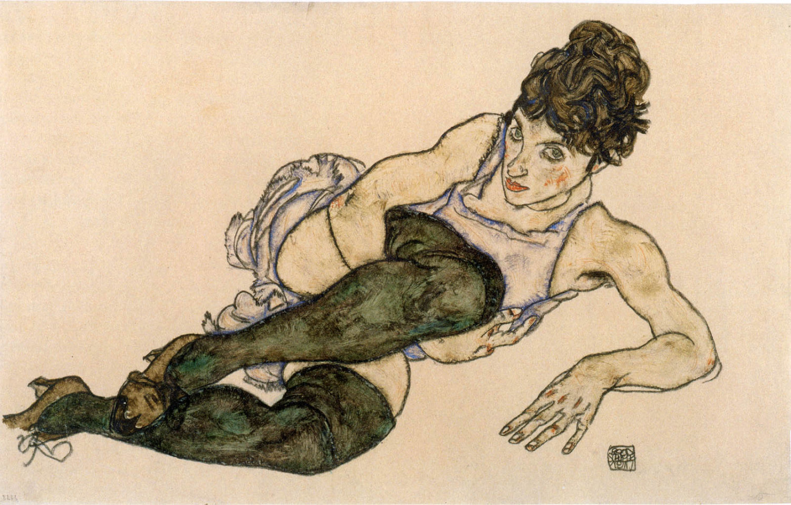

## 基本信息

- **作者**：[[席勒 Egon Schiele]]
- **创作年代**：1917
- **材质**：水彩 / 黑色蜡笔 / 纸 (*not from wiki*)
- **现存地**：私人收藏 (*not from wiki*)

## 画面与技法

席勒妻子爱迪斯·哈姆斯的斜倚像。绿色丝袜是席勒晚期肖像中反复出现的色彩元素。与沃莉时期的紧张焦灼相比，爱迪斯肖像**更平稳、更家庭化**——折射出席勒生命最后阶段向布尔乔亚生活的妥协（顾衡 075）。

## 历史背景 (*not from wiki*)

参见 [[屈膝坐着的女人 (爱迪斯) Seated Woman with Bent Knee (Edith Harms)]]。爱迪斯 1918 年死于西班牙流感。

## 图片清单

| 编号 | 出自 | 描述 |
|---|---|---|
| 01 | [[075｜席勒2：为什么他是"最表现主义"的画家？]] | 绿丝袜斜倚 |

## 出现在

- [[075｜席勒2：为什么他是"最表现主义"的画家？]]
