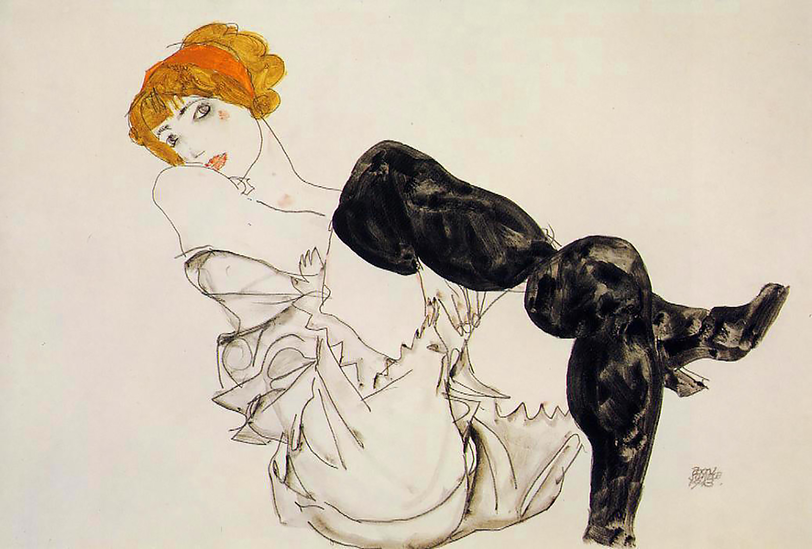

## 基本信息

- **作者**：[[席勒 Egon Schiele]]
- **创作年代**：1913
- **材质**：水彩 / 铅笔 / 纸 (*not from wiki*)
- **现存地**：私人收藏 (*not from wiki*)

## 画面与技法

沃莉·纽齐尔的另一幅亲密肖像。席勒在表现沃莉时往往**不掩饰其性吸引力**——这与他对女性的整体焦虑形成鲜明对照（顾衡 075）。

## 历史背景 (*not from wiki*)

沃莉与席勒关系详见 [[穿红衬衣的沃莉 Wally with a Red Blouse]]。1915 年遭抛弃后死于战地医院。

## 图片清单

| 编号 | 出自 | 描述 |
|---|---|---|
| 01 | [[075｜席勒2：为什么他是"最表现主义"的画家？]] | 黑丝袜坐姿 |

## 出现在

- [[075｜席勒2：为什么他是"最表现主义"的画家？]]
