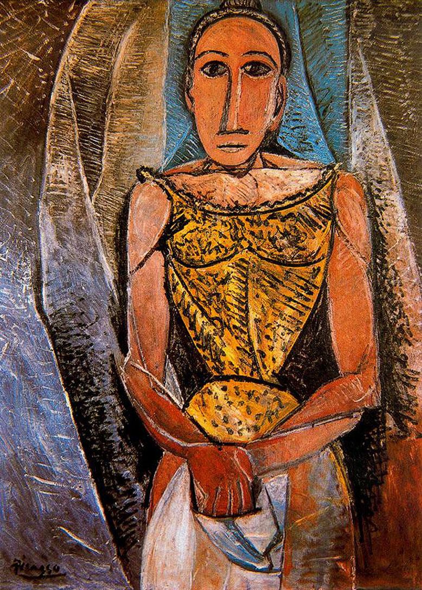

## 基本信息

- 作者：[[毕加索 Pablo Picasso]]
- 创作年代：1907
- 材质：油彩，画布 (*not from wiki*)
- 尺寸：(*not from wiki*)
- 现存地：(*not from wiki*)

## 画面与技法

[[黑人时期 African Period (Picasso)|黑人时期]] 1907 年作品——属于《[[亚威农少女 Les Demoiselles d'Avignon|亚威农少女]]》同年的"周边产物"：

- **面具化的脸**——直接借自非洲木雕；
- **躯体几何化**——肢体简化为圆柱与体块；
- **色彩压低**——黄、赭、土褐为主，刻意去掉光的细致变化。

顾衡把本作与《[[友谊 Friendship (Picasso)|友谊]]》《[[三个裸女 Three Women (Picasso)|三个裸女]]》《[[弹曼陀铃的女人 Woman with a Mandolin (Picasso)|弹曼陀铃的女人]]》并列，作为"打着塞尚旗号画非洲木雕"的样本。

## 历史背景 (*not from wiki*)

属于毕加索 1907—1908 年间一系列直接挪用非洲面具造型的女性肖像之一；具体的存藏情况现今不易追溯（顾衡课文未给定）。

## 图片清单

| 编号 | 出自 | 描述 |
|---|---|---|
| 01 | [[065｜毕加索2：如何理解"黑人时期"？]] | 全图——1907 年面具化女性肖像样本 |

## 出现在

- [[065｜毕加索2：如何理解"黑人时期"？]] —— [[黑人时期 African Period (Picasso)|黑人时期]] 1907 年代表作之一
