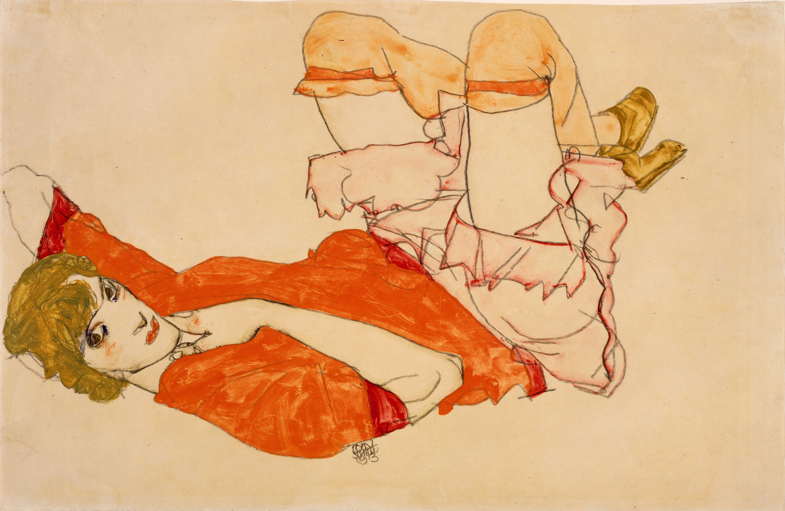

## 基本信息

- **作者**：[[席勒 Egon Schiele]]
- **创作年代**：1913
- **材质**：水彩 / 铅笔 / 纸 (*not from wiki*)
- **现存地**：私人收藏 (*not from wiki*)

## 画面与技法

沃莉·纽齐尔（Wally Neuzil）的肖像——她曾是 [[克里姆特 Gustav Klimt]] 的**模特和情人**，认识席勒后与之同居五年（约 1911–1915）；她同时担任席勒的**模特、情人、销售助理、起居照料者**，是席勒最重要的伴侣之一（顾衡 075）。

## 历史背景 (*not from wiki*)

沃莉在席勒 1912 年入狱期间**亲自送他到监狱**，并在他出狱时在门外迎候。1915 年席勒为娶布尔乔亚出身的爱迪斯·哈姆斯（Edith Harms）抛弃了沃莉，沃莉随后加入红十字会做战地护士，1917 年在战地医院**死于猩红热**。

## 图片清单

| 编号 | 出自 | 描述 |
|---|---|---|
| 01 | [[075｜席勒2：为什么他是"最表现主义"的画家？]] | 红衬衣半身像 |

## 出现在

- [[075｜席勒2：为什么他是"最表现主义"的画家？]]
