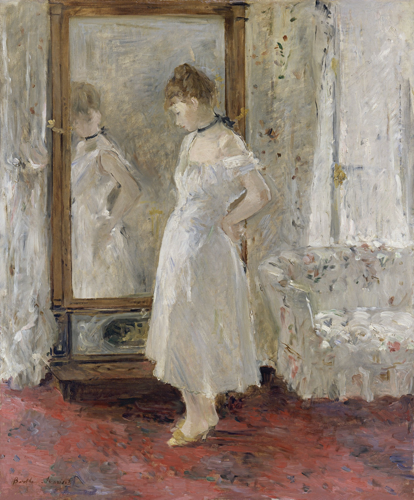

## 基本信息

- 作者：[[莫利索 Berthe Morisot]]
- 创作年代：1877
- 材质：布面油画 (*not from wiki*)
- 尺寸：65 × 54 cm (*not from wiki*)
- 现存地：马德里 Museo Nacional Thyssen-Bornemisza (*not from wiki*)

## 画面与技法

[[莫利索 Berthe Morisot]] 室内场景的代表作之一——年轻女性在 **psyché**（即可调角度的全身穿衣镜）前整理衣裙。镜中的镜像与实景在画面上**几乎平等地占据空间**——是莫利索对印象派"**即时眼睛的真实所见**"的内化：镜面反射不再被处理成"次级画面"，而是与本体同样使用细碎小色块绘出。

## 在课程中的角色

顾衡 044 把它列入莫利索"**贯彻印象派理念的样本组**"——演示她"即使画人物脸部也坚持不用平涂"的不妥协。

## 图片清单

| 编号 | 出自 | 描述 |
|---|---|---|
| 01 | [[044｜莫利索和毕沙罗：最纯正的印象派什么样？]] | 全画 |

## 出现在

- [[044｜莫利索和毕沙罗：最纯正的印象派什么样？]] —— 莫利索"印象派教科书"样本之一
- [[莫利索 Berthe Morisot]] —— 代表作之一
