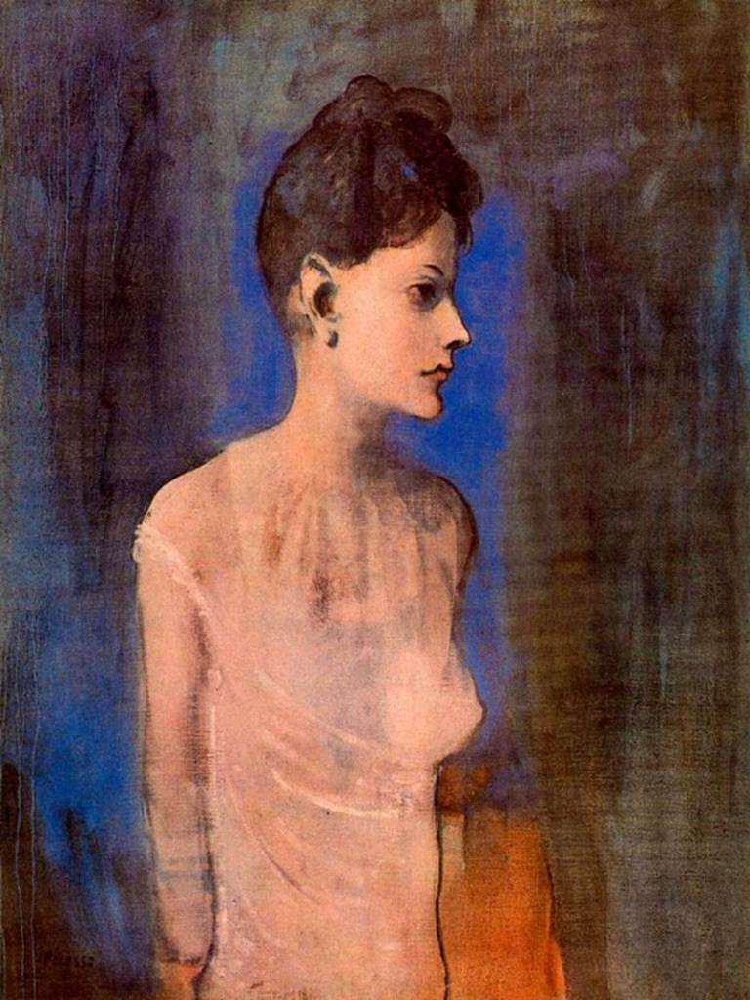

## 基本信息

- 作者：[[毕加索 Pablo Picasso]]
- 创作年代：1905
- 材质：布面油画 (*not from wiki*)
- 尺寸：72.7 × 60 cm (*not from wiki*)
- 现存地：伦敦泰特美术馆 (Tate Modern) (*not from wiki*)

## 画面与技法

[[玫瑰红时期 Rose Period]] 代表作——一名瘦削女子穿白色衬衫的半身像。本讲（064）将其与 [[不快乐的母亲和孩子 Mother and Child (Picasso)]]、[[拿烟斗的男孩 Boy with a Pipe]] 一同列为 **"玫瑰红时期只是换色"** 的样本：与 [[蓝色时期 Blue Period]] 作品比，造型语言完全一致（[[夏凡纳 Pierre Puvis de Chavannes]] 式简化 + [[埃尔·格列柯 El Greco]] 式拉长 / 舞台定格），唯一差别是色调由蓝换成玫瑰红——而 **画面上的人物丝毫没有开心的样子**。

## 历史背景 (*not from wiki*)

- 1905 年毕加索的模特之一 Madeleine（一名年轻情人，本作有时即被称作 *Madeleine*）。
- 是玫瑰红时期最早的代表作之一。

## 图片清单

| 编号 | 出自 | 描述 |
|---|---|---|
| 01 | [[064｜毕加索1：如何理解"蓝色时期"和"玫瑰红时期"？]] | 整幅画面 |

## 出现在

- [[064｜毕加索1：如何理解"蓝色时期"和"玫瑰红时期"？]]
