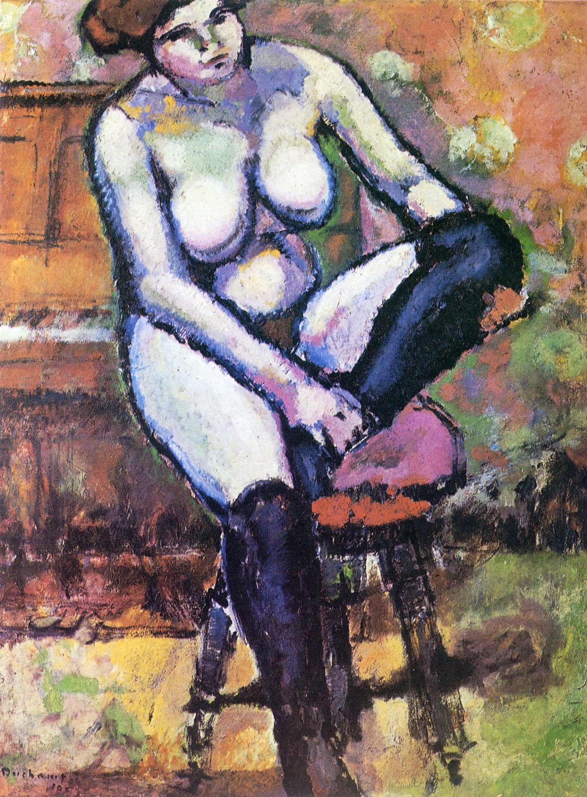

## 基本信息

- 作者：[[杜尚 Marcel Duchamp]]
- 创作年代：1910
- 材质：油画 (*not from wiki*)
- 尺寸：约 116 × 89 cm (*not from wiki*)
- 现存地：私人收藏 (*not from wiki*)

## 画面与技法

本讲（088）作为杜尚**坚持 [[野兽派 Fauvism]] 手法**的代表（1910 期）出场——"都是用黑边构个轮廓，然后用厚涂的笔触填上主观的颜色"（[[厚涂 Impasto]] + 主观色彩）。

顾衡用这幅作品**类比**杜尚 1909 年那幅**下落不明**的《沙发上的裸女》——后者被美国舞蹈家 [[邓肯 Isadora Duncan]] 买去当礼物送闺密，"因为邓肯没说送的具体是谁，那幅画也就不知道所踪"。

与马蒂斯的差异同《[[坐在窗边的人 Man Seated by a Window]]》一致：保留[[马奈 Édouard Manet]]式浅空间，不做完全压扁。

## 历史背景

(*not from wiki*) 杜尚 1910 年作品的代表之一，与同年开始的"塞尚期"作品并存——杜尚此时正在多个流派间小心尝试。

## 图片清单

| 编号 | 出自 | 描述 |
|---|---|---|
| 01 | [[088｜杜尚1：他"好好画画"是什么样子的？]] | 整体图——黑边轮廓 + 厚涂主观色彩 |

## 出现在

- [[088｜杜尚1：他"好好画画"是什么样子的？]]
