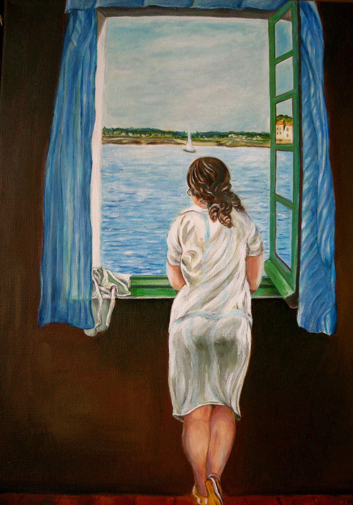

## 基本信息

- 作者：[[达利 Salvador Dalí]]
- 创作年代：1925
- 材质：布面油画 (*not from wiki*)
- 尺寸：(*not from wiki*) 105 × 74.5 cm
- 现存地：(*not from wiki*) 马德里苏菲亚王后国家艺术中心博物馆（Museo Reina Sofía）

## 画面与技法

094 中作为达利**学院派阶段**绘画功底扎实的样本登场——顾衡："我们看他的《窗边的少女》和《岩石上的女人》，画得非常好。"

(*not from wiki*) 一位短发少女背对观众站在窗前眺望卡达克斯海湾（达利家乡 Cap de Creus 附近），画面以精细写实的灰蓝调与日光透射处理，**与他后来的"软钟梦境"完全是两个画家**——证实其学院派功底。

## 历史背景 (*not from wiki*)

模特是达利的妹妹 Ana María Dalí。1925 年首次在巴塞罗那 Galeries Dalmau 个展中展出，正是这次展览的成功让远在巴黎的 [[毕加索 Pablo Picasso]] 听说"母校（[[圣费尔南多皇家艺术学院]]）出了个很有才华的小学弟"。

## 图片清单

| 编号 | 出自 | 描述 |
|---|---|---|
| 01 | [[094｜达利：为什么他画的是"伪装的梦"？]] | 全图 |

## 出现在

- [[094｜达利：为什么他画的是"伪装的梦"？]]
