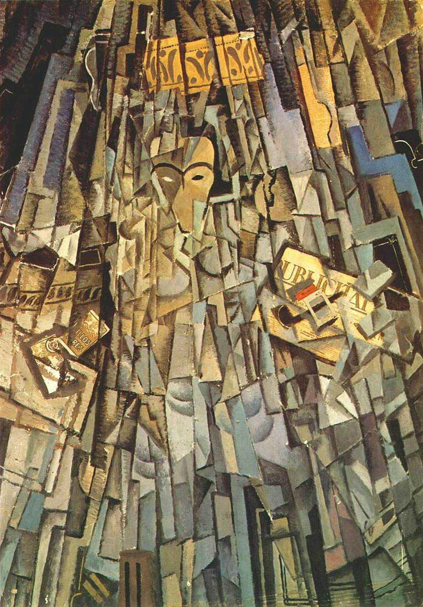

## 基本信息

- 作者：[[达利 Salvador Dalí]]
- 创作年代：1923
- 材质：纸板上水粉、油画 (*not from wiki*)
- 尺寸：(*not from wiki*) 104.9 × 74.2 cm
- 现存地：(*not from wiki*) 马德里苏菲亚王后国家艺术中心博物馆（Museo Reina Sofía）

## 画面与技法

094 中作为达利**学院期偷偷学 [[毕加索 Pablo Picasso]] 分析立体主义**的样本登场——顾衡："他 1923 年画的这幅《立体主义艺术家的自画像》，也让他在追求先锋艺术的同学们中得到了很高的赞誉。"

(*not from wiki*) 把面孔与上半身切割成立体主义的几何小块块，但在头部加入**报纸拼贴**（写有 "L'INTRAN"、"LE JOURNAL" 等字样）——是毕加索/布拉克[[拼贴 Collage]]技术的直接习作。

## 历史背景 (*not from wiki*)

属于达利"老师认可学院派、同学私下视他为先锋艺术弄潮儿"的"三六万两头叫"阶段（094）。日后达利赴巴黎拜见毕加索之后，**再也不肯画立体主义那些几何小块块了**——本作成为他立体主义阶段的代表与终点之一。

## 图片清单

| 编号 | 出自 | 描述 |
|---|---|---|
| 01 | [[094｜达利：为什么他画的是"伪装的梦"？]] | 全图 |

## 出现在

- [[094｜达利：为什么他画的是"伪装的梦"？]]
