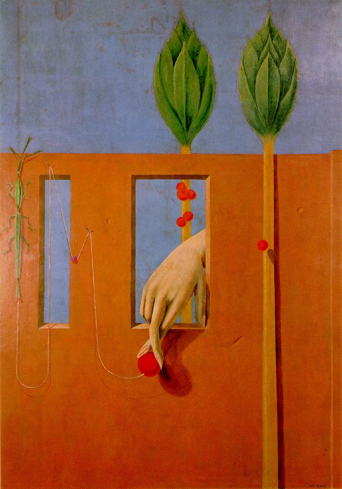

## 基本信息

- 作者：[[恩斯特 Max Ernst]]
- 创作年代：1923（系艾吕雅家中壁画的一部分） (*not from wiki*)
- 材质：墙面油画（后期移至画布） (*not from wiki*)
- 现存地：杜塞尔多夫艺术宫 K20 (*not from wiki*)

## 画面与技法

恩斯特巴黎初期、寄住于 [[艾吕雅 Paul Éluard]] 家中时为艾吕雅住所所作的**墙面绘画**之一（艾吕雅夫妇离家逃亡后，该壁画被剥离移转至画布保存）(*not from wiki*)。

本课把它放在"深受艾吕雅影响时期"的诗意路径并列序列中。标题"第一个清晰的字眼"——本身就是个充满诗意暗示的错位短语，与画面里悬浮的红色果实、女人的手指、墙体上的开口共同构成**洛特雷阿蒙式**的不连续诗意。

## 图片清单

| 编号 | 出自 | 描述 |
|---|---|---|
| 01 | [[093｜契里柯与恩斯特：如何用绘画表现超现实主义？]] | 红色墙面，一只悬空的手用手指指向空中悬浮的红色果实，画面下方有一只昆虫 |

## 出现在

- [[093｜契里柯与恩斯特：如何用绘画表现超现实主义？]] — 恩斯特"诗意路径"组作之一
