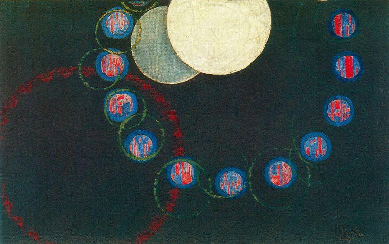

## 基本信息

- 作者：[[库普卡 František Kupka]]
- 创作年代：1910–1913
- 材质：油画 (*not from wiki*)
- 尺寸：(*not from wiki*：约 83 × 130 cm)
- 现存地：(*not from wiki*：纽约现代艺术博物馆 MoMA)

## 画面与技法

画面由若干圆形色块构成，乍看与 [[多个圆 Several Circles]] 一样非具象、不知所云。但根据顾衡引述，库普卡此画**意图表现的是太阳、月亮和行星之间的关系**——画面非具象，但意图具象。

## 历史背景 (*not from wiki*)

库普卡是早期非具象绘画的探索者之一，与 [[俄耳浦斯立体主义 Orphism]] 关系密切。本课程将其作为辨析"抽象画"概念的关键反例：仅看画面是否表现得"像具体事物"不足以判定抽象画，必须看**画家是否有具象意图**。

## 图片清单

| 编号 | 出自 | 描述 |
|---|---|---|
| 01 | [[081｜康定斯基1：什么是抽象绘画？]] | 黑底圆形构成；意图表现太阳、月亮与行星关系 |

## 出现在

- [[081｜康定斯基1：什么是抽象绘画？]]
