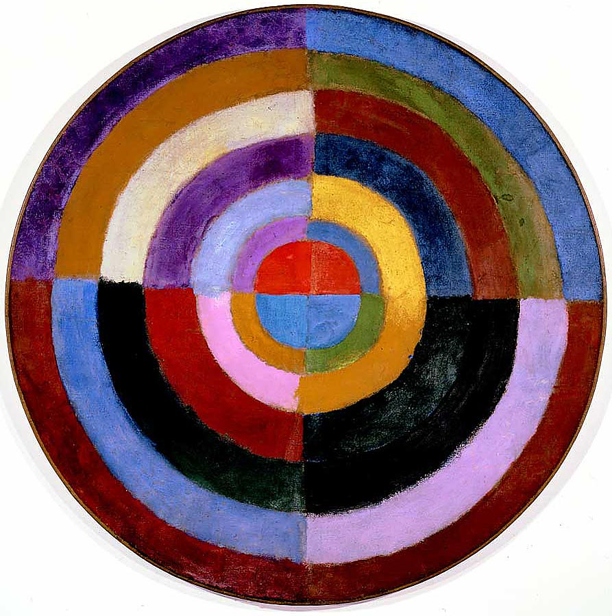

## 基本信息

- 作者：[[德劳内 Robert Delaunay]]
- 创作年代：1913
- 材质：布面油画 (*not from wiki*)
- 尺寸：直径约 134 cm（圆形画布）(*not from wiki*)
- 现存地：私人收藏 (*not from wiki*)

## 画面与技法

通常被视为**西方绘画史上第一幅完全抽象的画作之一**——画面就是一个圆形画布，被分割为**多组同心扇环**，每个扇环填入不同的纯色。**完全没有具象**。

顾衡明示："**修拉的色盘在德劳内的手中旋转起来之后，就变成了五彩缤纷的色环。**"——这是 [[谢弗勒尔 Michel Eugène Chevreul]] / [[修拉 Georges Seurat]] 色彩理论 + 德劳内"颜色对应音节"理念的视觉化结果。

## 历史背景 (*not from wiki*)

被认为是 20 世纪**抽象绘画的起源作品之一**——与康定斯基、马列维奇并列为"谁是第一个画抽象画的人"竞争者。顾衡的立场是 **"现在很多人把德劳内视为抽象派绘画的第一人，我认为是有道理的。"**

## 图片清单

| 编号 | 出自 | 描述 |
|---|---|---|
| 01 | [[068｜立体主义，除了毕加索还值得了解什么？]] | 同心圆色环；西方第一幅完全抽象画之一 |

## 出现在

- [[068｜立体主义，除了毕加索还值得了解什么？]] —— "抽象派绘画第一人"论据
