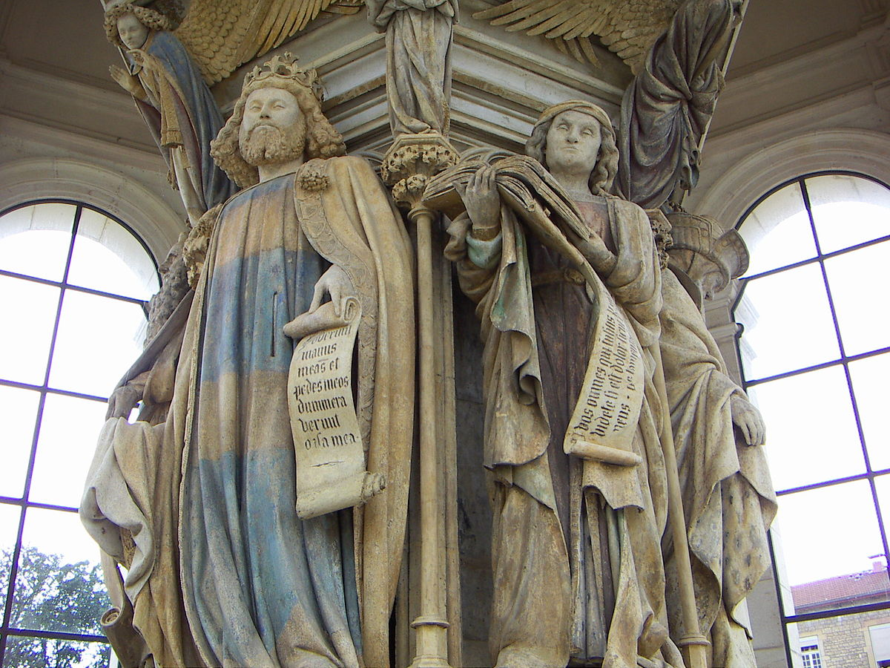

## 基本信息

- 作者：[[克洛斯·斯吕特尔 Claus Sluter]]（雕塑），原顶部群像有 Claus de Werve 接手
- 创作年代：1395–1403 (*not from wiki*)
- 材质：石灰岩 + 原彩绘 + 部分镀金（彩绘已大部褪失） (*not from wiki*)
- 尺寸：六角形基座，高约 7 m（含已残缺的十字架顶）
- 现存地：法国第戎夏特勒兹·德·尚波修道院遗址 (Chartreuse de Champmol, Dijon) (*not from wiki*)

## 画面与技法

六角形巨柱基座，**六位旧约先知**（摩西、大卫、耶利米、撒迦利亚、但以理、以赛亚）环柱而立，每位都是真人尺寸的圆雕。

形式特征：

- **体积厚实**——人物不再是浮雕式的"贴墙嵌入"，而是真正的三维独立体；
- **衣纹下有真实的人体结构**——衣褶随身体动作堆叠，类似古罗马晚期雕塑；
- **个性化面部**——摩西的胡须、耶利米的低头、大卫的国王相，每位都不同；
- 原本基座顶端架有十字架与基督、抹大拉的玛利亚、圣约翰群像（已残） (*not from wiki*)。

顾衡评价："与古罗马时期的雕塑相比已经难分伯仲"——它是 [[哥特艺术 Gothic Art]] 回归古希腊古罗马写实的高点，也是"古希腊老祖宗传下来的手艺至少在远离罗马的法兰西并没有丢"的直接物证。

## 历史背景

(*not from wiki*) 勃艮第公爵菲利普二世 (Philippe le Hardi) 在第戎建造夏特勒兹·德·尚波修道院作为家族陵寝。Claus Sluter 1389 年起任宫廷雕塑师，1395 年起主持本作。此作开启了 14 世纪末勃艮第宫廷写实主义雕塑的高潮，是早期尼德兰文艺复兴的先声。

## 图片清单

| 编号 | 出自 | 描述 |
|---|---|---|
| 01 | [[005｜哥特艺术1：为什么说它是文艺复兴的前奏？]] | 整体图 / 局部 |

## 出现在

- [[005｜哥特艺术1：为什么说它是文艺复兴的前奏？]]
