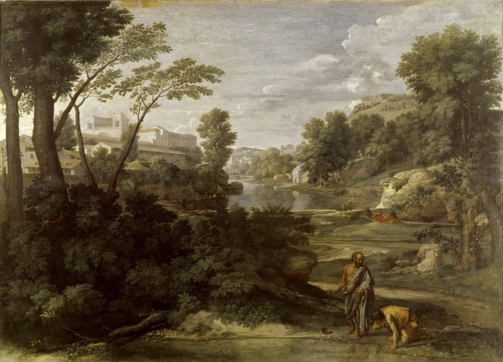

## 基本信息

- 作者：[[普桑 Nicolas Poussin]]
- 创作年代：1647
- 材质：布面油画 (*not from wiki*)
- 尺寸：160 × 221 cm (*not from wiki*)
- 现存地：巴黎卢浮宫 (Musée du Louvre) (*not from wiki*)

## 画面与技法

题材：犬儒派哲学家**第欧根尼**看到一个年轻人**用手捧水喝**——意识到连自己仅有的木碗也是多余之物，于是**扔掉碗**。这是一则**反消费主义**的古希腊轶事。

**顾衡 037 重点**：

- 与 [[洛兰 Claude Lorrain]] 走的是**同一条路**：**取材神话或圣经，但把人画得小小的**——名义古典哲人故事，**其实就是风景画**
- 本作中第欧根尼与年轻人**占画面不到 1/10**——其余**全是普桑式的理想化风景**：高大的橡树、远处的城市、平静的河流
- 启发 200 年后的 [[巴比松画派 Barbizon School]]——但巴比松摘下了哲人故事的遮羞布
- 顾衡引绘画五等：**风景画拿不上台面，只比静物高级一点**——所以 [[洛兰 Claude Lorrain]] / [[普桑 Nicolas Poussin]] 必须"曲线救国"

**形式上**：

- **几何透视法**严格构图——与[[米开朗基罗 Michelangelo]] 批评北方画家"没有理性、没有对称和比例"那段话**完美呼应**
- 普桑标志的**冷峻、理性、不滥情**——所谓"哲学风景"——后世称为 _paysage philosophique_ (*not from wiki*)
- 与同代 [[洛兰 Claude Lorrain]] 的**金色温暖逆光**形成对照：洛兰是诗、普桑是哲学

## 历史背景

(*not from wiki*) 普桑晚期罗马时期为某法国藏家所作（具体委托人不详）。1869 年入卢浮宫。普桑死后 100 年法国**新古典主义**兴起时被奉为"法兰西的拉斐尔"，本作是其"哲学风景"系列代表。

## 图片清单

| 编号 | 出自 | 描述 |
|---|---|---|
| 01 | [[037｜为什么说古典时代没有风景画？]] | 整体图 |

## 出现在

- [[037｜为什么说古典时代没有风景画？]]
