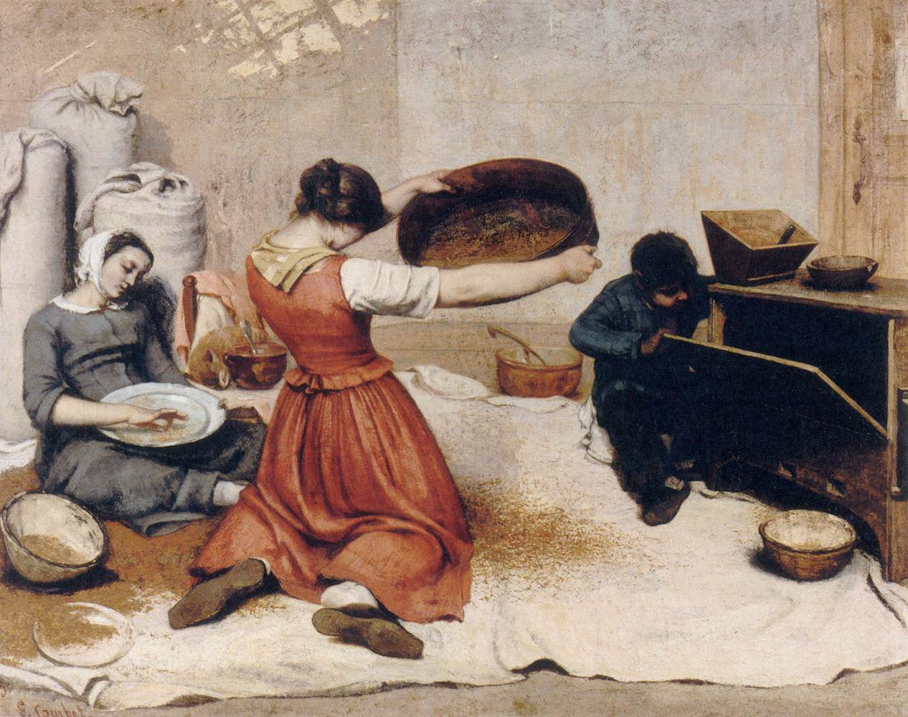

## 基本信息

- 作者：[[居斯塔夫·库尔贝 Gustave Courbet]]
- 创作年代：1854
- 材质：布面油画 (*not from wiki*)
- 尺寸：约 131 × 167 cm (*not from wiki*)
- 现存地：南特艺术博物馆 Musée d'arts de Nantes (*not from wiki*)

## 画面与技法

三位库尔贝身边的女性（其妹妹 Zoé 等）在屋内筛麦——前景女性背对观者跪坐筛筐、左侧持袋女子站立、右侧小男孩盯着筛具。**学院派从未画过的"劳动场景"**。

## 历史背景

顾衡 035 明示：

> 他看到了**筛麦女、碎石工**，就把这些劳动的场景都画下来。以前学院派都画神话、画英雄，那么库尔贝选择的题材，对于学院派而言就是颠覆性的。

这是 [[现实主义 Realism]] **题材政治学**的典型样本——把劳动者放上沙龙级油画。

## 图片清单

| 编号 | 出自 | 描述 |
|---|---|---|
| 01 | [[035｜库尔贝：为什么现实主义的开创者争议那么大？]] | 三位女子筛麦场景 |

## 出现在

- [[035｜库尔贝：为什么现实主义的开创者争议那么大？]]
