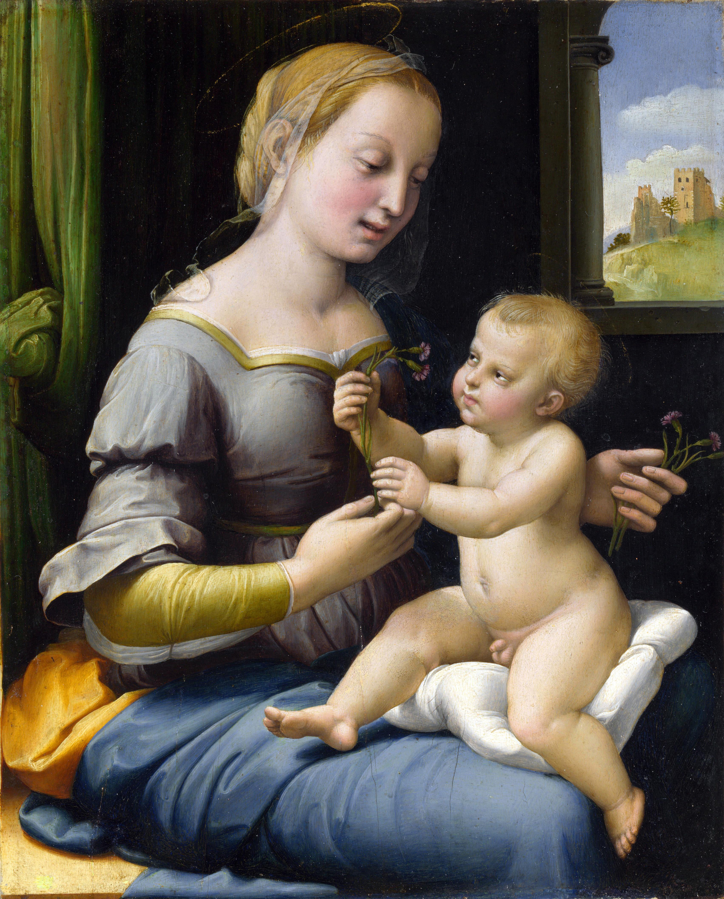

## 基本信息

- 作者：[[拉斐尔 Raphael]]
- 创作年代：约 1506–1507 (*not from wiki*)
- 材质：紫杉木板油彩
- 尺寸：27.9 × 22.4 cm (小尺寸卧房用画) (*not from wiki*)
- 现存地：伦敦国家美术馆 (The National Gallery, London) (*not from wiki*)

## 画面与技法

圣母与圣子坐在打开窗前，圣母怀里抱着圣子，**两人正在交换几朵粉红色 dianthus 花** (pinks)。

**全方位致敬达·芬奇**：

- 色调通过细腻变化塑造形体——[[晕涂法 Sfumato]] 的应用，几乎无可见线条；
- 远景透过窗户呈现 [[空气透视法 Atmospheric Perspective]] 的轻雾山水；
- 圣母手持小花伸向圣子的构图直接借鉴 [[康乃馨圣母 Madonna of the Carnation]] (达·芬奇 1478–80)。

但顾衡 011 注："拉斐尔笔下的人物**还是包括了一定的线条感**——他理解并欣赏达·芬奇，却并不想走得那么远，而是在各个矛盾的要素之间有所取舍，以保持平衡。"

瓦萨里："**拉斐尔是所有画家中与达·芬奇绘画风格最相似的，尤其是那一抹优美的色调。**"

## 历史背景

(*not from wiki*) 长期被认为是达·芬奇风格的复制品；1991 年被英国艺术史家 Nicholas Penny 重新确认为拉斐尔真迹；2004 年 NG 以 £22 million 购入（部分由 Heritage Lottery Fund 资助）。是拉斐尔从翁布里亚甜美风转向达·芬奇明暗法的过渡见证。

## 图片清单

| 编号 | 出自 | 描述 |
|---|---|---|
| 01 | [[011｜拉斐尔：为什么说他是"集大成者"？]] | 整体图 |
| 02 | [[018｜矫饰主义：过度追求形式有什么后果？]] | 整体图（作为新柏拉图主义美学的标准答案对照） |

## 出现在

- [[011｜拉斐尔：为什么说他是"集大成者"？]]
- [[018｜矫饰主义：过度追求形式有什么后果？]]（拉斐尔的新柏拉图主义标准答案）
