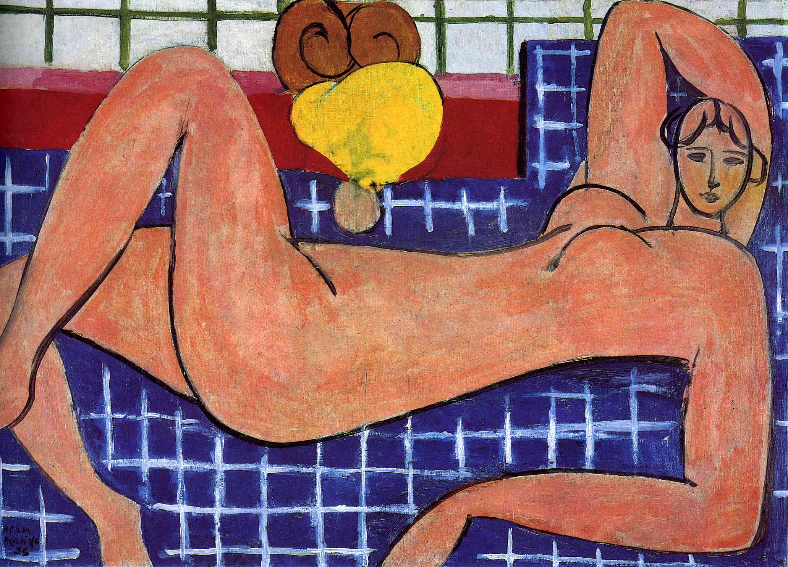

## 基本信息

- 作者：[[马蒂斯 Henri Matisse]]
- 创作年代：1935
- 材质：油画 (*not from wiki*)
- 尺寸：(*not from wiki*)
- 现存地：(*not from wiki* Baltimore Museum of Art)

## 画面与技法

062 援引为马蒂斯**晚期作品特点**的范本：**简化 + 装饰性**。

要点（062）：

- 一战结束后马蒂斯重新回到主调（区别于 1911–1917 [[立体主义 Cubism]] 短插曲）
- 相比战前，**更喜欢在画中加阿拉伯风格的花纹**
- 作品**更强调装饰性**
- 此画"很好地体现了他晚期作品的特点：简化和装饰性"

(*not from wiki*) 画面是横向卧姿粉色裸女、背景方格网状装饰——把人体简化为流畅曲线的色块，与方格几何花纹形成对位。

## 历史背景 *(not from wiki)*

(*not from wiki*) 1935 创作，是马蒂斯在被卧床和剪纸取代之前最重要的油画晚期作品之一。Baltimore Museum of Art 藏。

## 图片清单

| 编号 | 出自 | 描述 |
|---|---|---|
| 01 | [[062｜马蒂斯3：如何理解他一生的创作？]] | 粉色卧姿裸女 + 方格花纹背景 |

## 出现在

- [[062｜马蒂斯3：如何理解他一生的创作？]] —— 晚期"简化 + 装饰性"的范本
