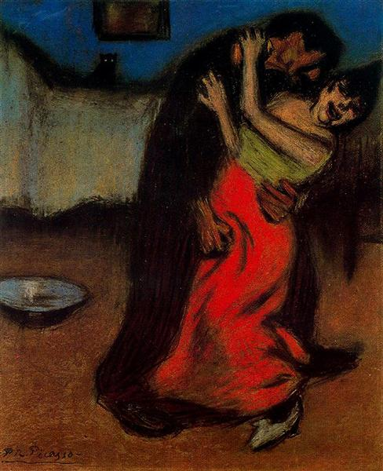

## 基本信息

- 作者：[[毕加索 Pablo Picasso]]
- 创作年代：1900
- 材质：布面油画 / 蜡笔 (*not from wiki*)
- 尺寸：年代不详 (*not from wiki*)
- 现存地：私人收藏 (*not from wiki*)

## 画面与技法

[[蓝色时期 Blue Period]] 早期最直白的肉欲题材作品之一——本讲将其作为毕加索 **"立即就投入到低俗的肉欲中去了"** 的核心样本，与同期色情画共同构成对"蓝色 = 抑郁忧伤"望文生义解读的反驳。

## 历史背景 (*not from wiki*)

- 1900 年的毕加索 19 岁、首到巴黎、波希米亚式生活，肉欲题材是这一年高频母题。

## 图片清单

| 编号 | 出自 | 描述 |
|---|---|---|
| 01 | [[064｜毕加索1：如何理解"蓝色时期"和"玫瑰红时期"？]] | 整幅画面 |

## 出现在

- [[064｜毕加索1：如何理解"蓝色时期"和"玫瑰红时期"？]]
