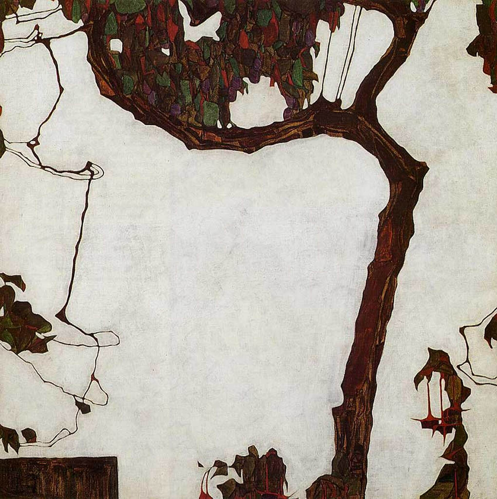

## 基本信息

- **作者**：[[席勒 Egon Schiele]]
- **创作年代**：1909
- **材质**：油彩 / 画布 (*not from wiki*)
- **现存地**：私人收藏 (*not from wiki*)

## 画面与技法

席勒以**北方哥特风**重塑自然万物之代表（顾衡 075）——一株细瘦扭曲、几近痉挛的孤树，秋天将尽，叶残花零。**高高的、瘦瘦的、冷峻的**——是席勒赋予风景的精神肖像。

## 历史背景 (*not from wiki*)

席勒的"树"在艺术史上常被看作"植物自画像"——把自身的神经状态投射到树上。

## 图片清单

| 编号 | 出自 | 描述 |
|---|---|---|
| 01 | [[075｜席勒2：为什么他是"最表现主义"的画家？]] | 秋树整株 |

## 出现在

- [[075｜席勒2：为什么他是"最表现主义"的画家？]]
