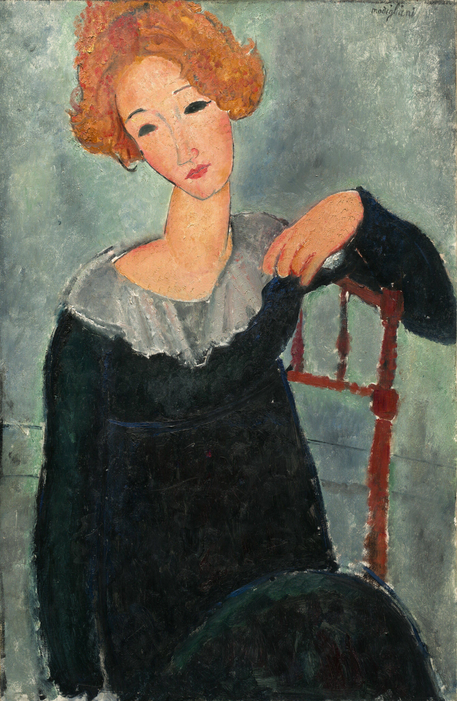

## 基本信息

- 作者：[[莫迪里阿尼 Amedeo Modigliani]]
- 创作年代：1917
- 材质：布面油画 (*not from wiki*)
- 尺寸：(*未知*)
- 现存地：(*未知*)

## 画面与技法

[[莫迪里阿尼 Amedeo Modigliani]] 成熟期肖像。顾衡 078 概括其**统一程式**：

> 长长的鼻子、长长的脖子，以及 [[波蒂切利 Botticelli]] 式关节脱臼般的曲线，以强化女性的柔美。眼睛要么是全黑没有眼白，要么是像大理石雕像一样一片灰矇，妖媚得近似鬼魅。他笔下的女性是那么美，却又如此遥不可及。

红发 + 灰矇空白眼 = 程式应用的范例。

## 历史背景 (*not from wiki*)

1917 年是莫迪里阿尼成熟期最高产年份——同年他举办了生平唯一一次个展（因被举报"淫秽"被警方中止）；又是在 1917 年认识了 [[珍妮·赫比特娜 Jeanne Hébuterne]]。

## 图片清单

| 编号 | 出自 | 描述 |
|---|---|---|
| 01 | [[078｜莫迪里阿尼：画中女子为什么让人一眼难忘？]] | 红发女子半身 |

## 出现在

- [[078｜莫迪里阿尼：画中女子为什么让人一眼难忘？]]
