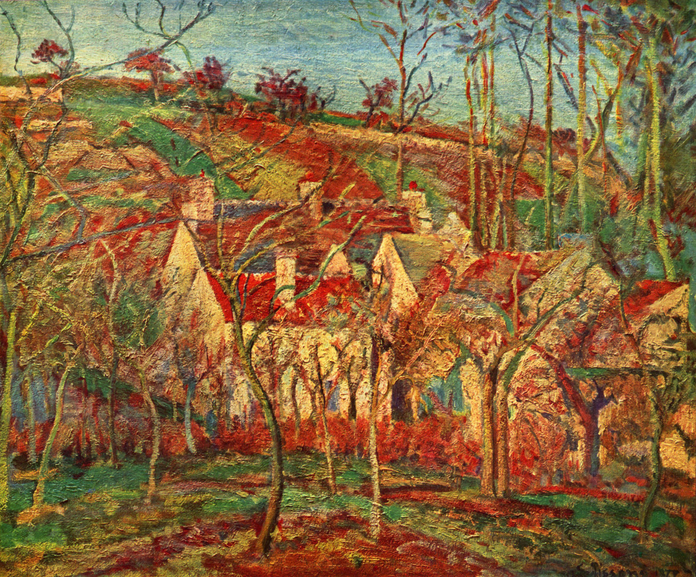

## 基本信息

- 作者：[[毕沙罗 Camille Pissarro]]
- 创作年代：1877
- 材质：布面油画 (*not from wiki*)
- 尺寸：54.5 × 65.6 cm (*not from wiki*)
- 现存地：巴黎奥赛博物馆 Musée d'Orsay (*not from wiki*)

## 画面与技法（顾衡 044 解读）

[[毕沙罗 Camille Pissarro]] **跳出舒适区**的代表作——**大片红屋顶**与**绿色田野**形成强烈对比。这是毕沙罗对评论家"画没什么看头"的批评做出的一次回应。顾衡 044 明示这种饱和度的强对比**不是毕沙罗的常态**——他总体上仍是恬淡内敛的，本作仅是"有一个阶段也跳出自己的舒适区"的尝试。

技法层面：透过冬日落叶林的枝桠依稀可见后景红屋顶——**叠加细密笔触**仍是核心方法，但本作把对比饱和度推到了毕沙罗作品中相对极端的位置。

## 在课程中的角色

顾衡 044 把它作为毕沙罗"**例外**"——演示毕沙罗并非永远低调，但即便在最饱和的对比里仍保留了印象派笔触的整体方法论。

## 图片清单

| 编号 | 出自 | 描述 |
|---|---|---|
| 01 | [[044｜莫利索和毕沙罗：最纯正的印象派什么样？]] | 全画，冬日红屋顶与绿田对比 |

## 出现在

- [[044｜莫利索和毕沙罗：最纯正的印象派什么样？]] —— 毕沙罗"跳出舒适区"的代表样本
- [[毕沙罗 Camille Pissarro]] —— 代表作之一
