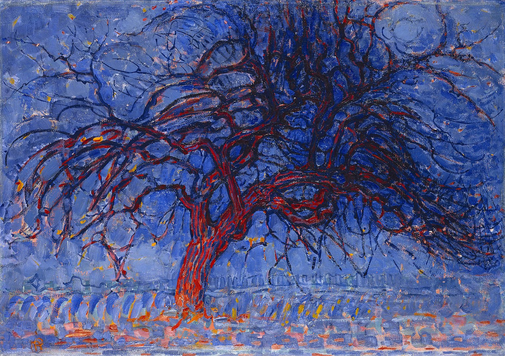

## 基本信息

- 作者：[[蒙德里安 Piet Mondrian]]
- 创作年代：1908–1910
- 材质：(*not from wiki*：布面油画)
- 尺寸：(*not from wiki*：约 70 × 99 cm)
- 现存地：(*not from wiki*：海牙市立博物馆)

## 画面与技法

蒙德里安 1911 年赴巴黎、接触 [[分析立体主义 Analytical Cubism]] 之前的画风：依然忠实于"树"这一具象物，色彩浓烈主观（红色枝干与蓝色背景），但线条已经显示出对枝干曲线本身的兴趣——它即将成为日后纯抽象线条的种子。

## 历史背景 (*not from wiki*)

蒙德里安自阿姆斯特丹美术学院毕业后很长一段时间作品"都是些大路货"。这幅《红树》是他 1911 年赴巴黎之前最具个人风格的"树"系列起点，后接 [[灰树 (蒙德里安) Gray Tree]]（1911）、[[开花的苹果树 (蒙德里安) Composition with Trees II]]（1912），呈现"从具象到几乎纯抽象"的整套过渡。

## 图片清单

| 编号 | 出自 | 描述 |
|---|---|---|
| 01 | [[084｜蒙德里安：他为什么要画那么多格子？]] | 红树（1908–1910） |

## 出现在

- [[084｜蒙德里安：他为什么要画那么多格子？]]
