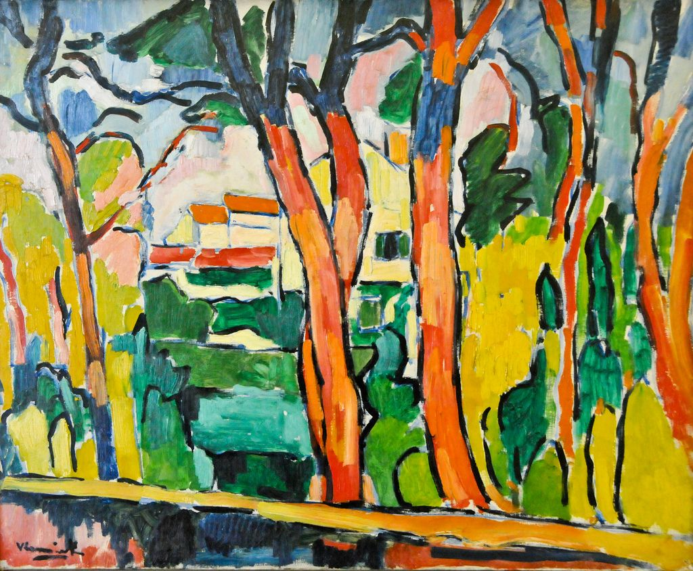

## 基本信息

- 作者：[[弗拉芒克 Maurice de Vlaminck]]
- 创作年代：1906
- 材质：油彩，画布 (*not from wiki*)
- 现存地：(*not from wiki*)

## 画面与技法

[[弗拉芒克 Maurice de Vlaminck]] 1906 年作品。顾衡 063：弗拉芒克和 [[凡·高 Vincent van Gogh]] 一样**偏爱厚涂颜色，偏爱狂放的笔触**，**对明亮的黄色情有独钟**——本作正是这种凡·高式炸眼色彩的典型样本。

颜料**直接从颜料管挤在画布上**（[[厚涂 Impasto]]）——顾衡 063 引弗拉芒克自述：

> 只有这样的方式，才能让内心破坏的本能去再造一个感性的、生活的和自由的世界。

红树意象**完全脱离自然观察**——是 [[野兽派 Fauvism]] **主观色彩自由** 最 "野兽" 的体现：弗拉芒克是顾衡 063 列出的野兽派三人中**唯一让人能感受到 "野兽"味道的画家**（"因为他们这一伙人里总算有人提到'破坏'这个词了"）。

## 历史背景 (*not from wiki*)

- 1906 年画商沃拉尔 (Ambroise Vollard) 买下 [[弗拉芒克 Maurice de Vlaminck]] 画室的全部作品，成为他的独家经纪人——他的"不管不顾、一味走极端的风格反而让他迅速取得了成功" (顾衡 063)。

## 图片清单

| 编号 | 出自 | 描述 |
|---|---|---|
| 01 | [[063｜野兽派，除了马蒂斯还能谈什么？]] | 整幅画面——弗拉芒克"凡·高式炸眼"代表作 |

## 出现在

- [[063｜野兽派，除了马蒂斯还能谈什么？]] —— 弗拉芒克厚涂+狂放笔触+破坏本能的样本
