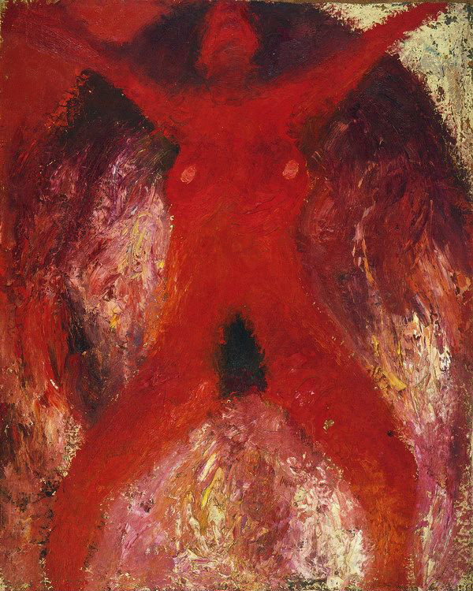

## 基本信息

- 作者：[[毛旭辉 Mao Xuhui]]
- 创作年代：1984
- 材质：布面油画 (*not from wiki*)
- 尺寸：(*not from wiki*)
- 现存地：(*not from wiki*)

## 画面与技法

"**[[八五新潮 '85 New Wave]]**" 运动代表作之一。**鲜艳而夸张的红色**、**被束缚的状态**、**喷薄欲出的性** —— 三者构成 **显而易见的矛盾**。

顾衡在 [[049｜夏凡纳：如何制作象征主义的密电码？]] 中专门用此画作 **象征主义 vs 表现主义** 的辨析：

> 很多评论家认为这也是一幅象征主义作品，我却并不这么认为……这些寓意都是在画面中直接给出的，却并没有通过"密电码"来做一道由画外向画内进行信号转换的工序……加缪说过，象征主义必须要由观念和感觉的两个平台共同构成。但是毛旭辉老师的这幅画，全部意思都在画里面了，并没有两个平面。所以，把这幅《红色人体》归为表现主义绘画似乎更合适一些。

—— 是顾衡用来 **划清象征主义边界** 的关键反例：**画外向画内的信号转换工序** 是判断象征主义的核心标准；缺失即归 **表现主义**。

## 历史背景 (*not from wiki*)

1984 年创作。"八五新潮"前夕，毛旭辉是"西南艺术研究群体"核心成员之一，《红色人体》是他这一阶段最受关注的作品。

## 图片清单

| 编号 | 出自 | 描述 |
|---|---|---|
| 01 | [[049｜夏凡纳：如何制作象征主义的密电码？]] | 整幅画面 |

## 出现在

- [[049｜夏凡纳：如何制作象征主义的密电码？]] —— 作为 **象征主义 vs 表现主义辨析反例** 被顾衡引用
