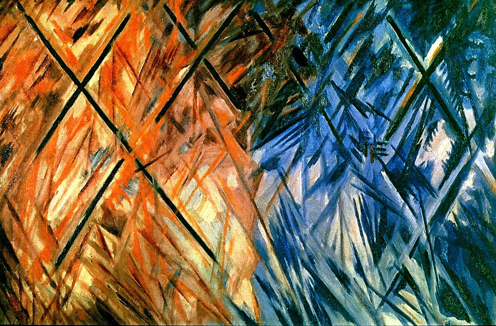

## 基本信息

- 作者：[[冈察洛娃 Natalia Goncharova]]
- 创作年代：1913
- 材质：布面油画 (*not from wiki*)
- 尺寸：年代不详 (*not from wiki*)
- 现存地：私人收藏 (*not from wiki*)

## 画面与技法

[[辐射主义 Rayonnism]] 代表作。顾衡 083：把 [[修拉 Georges Seurat]] 的圆盘"想象成太阳，直接向外放射光芒"——画面是以一个中心点向四方放射的红、蓝色光束。

## 历史背景

顾衡 083：本作是 1913 年俄罗斯民族主义高涨背景下、[[冈察洛娃 Natalia Goncharova]] 试图与法国先锋艺术划清界限、"搞出自己的东西来"的产物。但本质上，它是对 [[新印象主义 Neo-Impressionism]] 色盘（[[修拉 Georges Seurat]]）和 [[俄耳浦斯立体主义 Orphism]]（[[德劳内 Robert Delaunay]] [[第一盘 (德劳内) First Disc]]）的本土改装。

## 图片清单

| 编号 | 出自 | 描述 |
|---|---|---|
| 01 | [[083｜马列维奇：什么是至上主义？]] | 全画 |

## 出现在

- [[083｜马列维奇：什么是至上主义？]]
