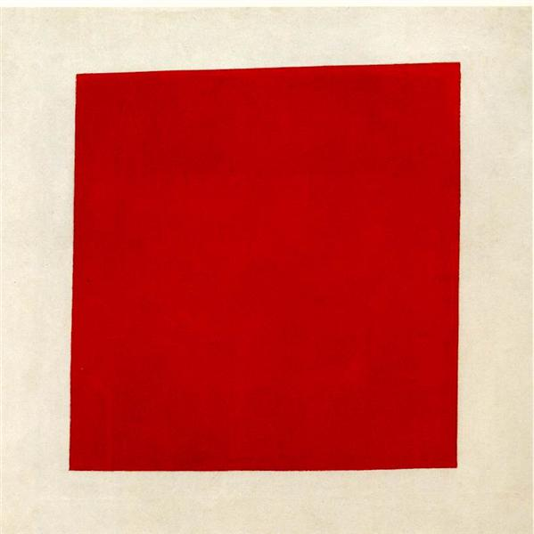

## 基本信息

- 作者：[[马列维奇 Kazimir Malevich]]
- 创作年代：1915
- 材质：布面油画 (*not from wiki*)
- 尺寸：53 × 53 cm (*not from wiki*)
- 现存地：俄罗斯圣彼得堡国立俄罗斯博物馆 (*not from wiki*)
- 副标题：《红色正方块：一个农妇在二维空间的绘画写实主义》(*not from wiki*)

## 画面与技法

[[至上主义 Suprematism]] **彩色阶段**的样本：白色画布上一个略微倾斜的红色四方形。

[[马列维奇 Kazimir Malevich]] 自释：在至上主义三阶段（黑、彩、白）中，**红方块 = 革命的信号**。

## 图片清单

| 编号 | 出自 | 描述 |
|---|---|---|
| 01 | [[083｜马列维奇：什么是至上主义？]] | 全画 |

## 出现在

- [[083｜马列维奇：什么是至上主义？]]
