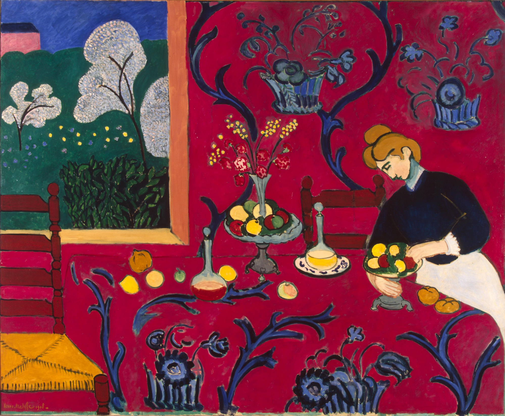

## 基本信息

- 作者：[[马蒂斯 Henri Matisse]]
- 创作年代：1908
- 材质：油画 (*not from wiki*)
- 尺寸：(*not from wiki*)
- 现存地：(*not from wiki* 圣彼得堡 / 冬宫博物馆)

## 画面与技法

[[马蒂斯 Henri Matisse]] 接触 [[柏格森 Henri Bergson]] [[生命哲学 Philosophy of Life]] 之后的**关键转折之作**——关注重点从"野兽派的色彩自由"转向"**主体与客体、理性与直觉的关系**"。

马蒂斯原话："**我像作曲家创造和声那样，来组织这些平涂的色块。**"

画面要点（062）：

- **狂放笔触不见了，立体感彻底消失**——典型的 [[平涂 Flat Colour]]
- **墙面和桌面一样的红色** = 表现生命的冲动，"一种汹涌的、植物一般的生命力"（[[直觉 Intuition (Bergson)]]）
- **无处不在的蓝色花纹**——桌布、墙面、女仆的发型、窗外的树都是同样的花纹样式 = **外在的理性**
- **红 + 蓝并置** = **外在的理性和内在的直觉之间的和解与和谐**

马蒂斯另一句配套宣言："**我用色彩来表达自己的情绪，正如以七个音符构成音乐那样。**"

## 历史背景 *(not from wiki)*

由俄国收藏家 [[史楚金 Sergei Shchukin]] 委托收藏 (*not from wiki*)，现藏于圣彼得堡冬宫。本作是马蒂斯"野兽派之后"方法论第一件**完整自觉的兑现**——为两年后的 [[舞蹈 (马蒂斯) Dance (Matisse)]] / [[音乐 (马蒂斯) Music (Matisse)]] 双联壁铺路。

## 图片清单

| 编号 | 出自 | 描述 |
|---|---|---|
| 01 | [[062｜马蒂斯3：如何理解他一生的创作？]] | 全景（红色房间、蓝花纹桌布、女仆与窗外）|

## 出现在

- [[062｜马蒂斯3：如何理解他一生的创作？]] —— 柏格森式转向的第一件代表作
