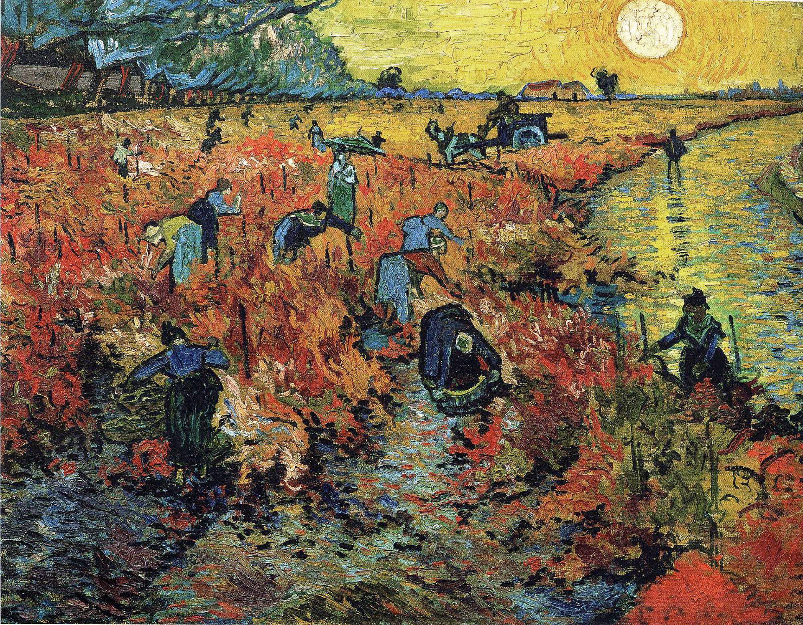

## 基本信息

- 作者：[[凡·高 Vincent van Gogh]]
- 创作年代：1888
- 材质：布面油画 (*not from wiki*)
- 尺寸：(*not from wiki*) 75 × 93 cm
- 现存地：(*not from wiki*) 莫斯科普希金博物馆 (Pushkin Museum)

## 画面与技法

阿尔勒附近落日中收获葡萄的群像——晚霞将葡萄园染成血红，人物剪影散布其间。

058 给出**这是凡·高生前唯一卖出的作品**，1890 年在布鲁塞尔的"二十人展"上由 [[安娜·博什 Anna Boch]] 以 **400 法郎**购入 (*not from wiki*) ——而凡·高靠 [[提奥 Theo van Gogh]] 每月 150 法郎生活，意味着这幅画约等于他两个半月的开销。

## 历史背景 (*not from wiki*)

凡·高 1888 年 10 月在阿尔勒附近的蒙马儒看到的葡萄园落日。同月 [[高更 Paul Gauguin]] 抵达阿尔勒与凡·高同住——以 12 月的"割耳事件"告终，结束了凡·高与高更"南方画室"的乌托邦实验。

## 图片清单

| 编号 | 出自 | 描述 |
|---|---|---|
| 01 | [[058｜凡·高2：为什么他的风格难以界定？]] | 整幅画作，凡·高生前唯一卖出之画 |

## 出现在

- [[058｜凡·高2：为什么他的风格难以界定？]]
