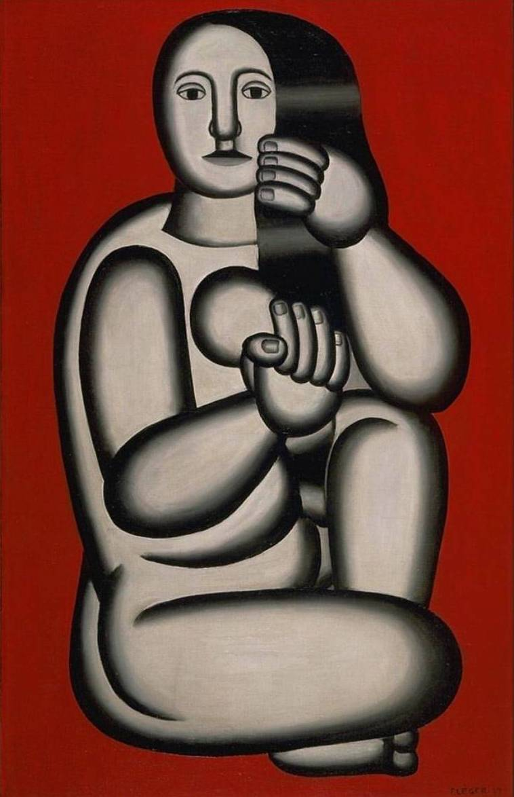

## 基本信息

- 作者：[[莱热 Fernand Léger]]
- 创作年代：1927
- 材质：布面油画 (*not from wiki*)
- 尺寸：约 130 × 89 cm (*not from wiki*)
- 现存地：私人收藏 / 数版本 (*not from wiki*)

## 画面与技法

莱热中晚期作品。背景大红，前景女性身体**继续以圆柱、椭圆与圆环堆叠**——但**色彩比战壕系列更鲜亮**。

引顾衡的总结："**我对色彩没什么兴趣，体积对我来说就够了。** 但其实，管子对他就够了。"

## 历史背景 (*not from wiki*)

莱热 1920 年代受**纯粹主义 (Purisme)** 与 Le Corbusier 的影响，画面更扁平、更工业化；这件 1927 作品体现这种转变。

## 图片清单

| 编号 | 出自 | 描述 |
|---|---|---|
| 01 | [[068｜立体主义，除了毕加索还值得了解什么？]] | 莱热中晚期管状裸女 |

## 出现在

- [[068｜立体主义，除了毕加索还值得了解什么？]] —— 莱热中晚期管状美学
