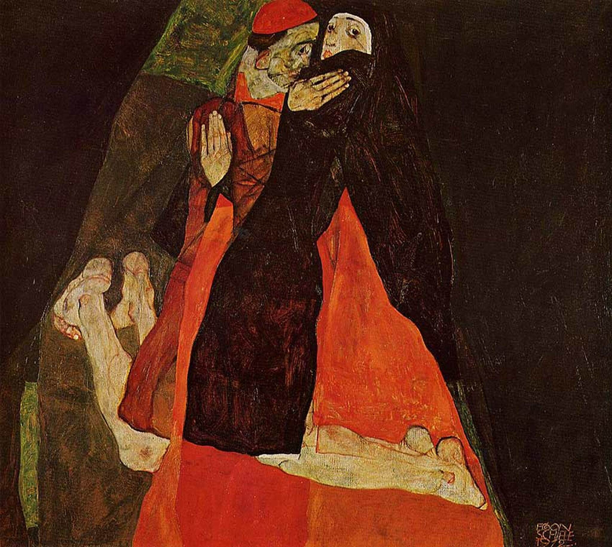

## 基本信息

- 作者：[[席勒 Egon Schiele]]
- 创作年代：1912
- 材质：（*not from wiki*）布面油画
- 尺寸：（*not from wiki*）70 × 80.5 cm
- 现存地：（*not from wiki*）维也纳利奥波德博物馆 Leopold Museum

## 画面与技法

顾衡 074 的核心案例之一——**对位 [[吻 The Kiss (克里姆特)]]**：

| 维度 | [[吻 The Kiss (克里姆特)]]（1907–1908） | 《红衣主教和修女》（1912） |
|---|---|---|
| 构图 | 男女紧拥 / 跪坐 / 金色装饰 | 男女紧拥 / 跪坐 / 红黑两色 |
| 情绪 | 甜蜜的、陶醉的 | **悲伤的、紧张的** |
| 风格归属 | [[象征主义 Symbolism]] | [[表现主义 Expressionism]]（焦虑 / 紧张型） |
| 解读钥匙 | 装饰寓意 / 性的符号 | [[神经官能症 Neurosis]] 的**焦虑 / 恐惧**分类 |

席勒"显然"是从克里姆特《吻》取构图和主题，**反转了情绪**——这正是顾衡 074 用来说明"为什么席勒是最表现主义的表现主义画家"的关键证据。

宗教身份的叠加（红衣主教 + 修女）——把"亲昵"放到**禁忌人物**身上，进一步放大焦虑张力，对应 [[弗洛伊德 Sigmund Freud]] 框架下"超我（社会习俗 / 宗教戒律）打败本我"的视觉化。

## 历史背景 (*not from wiki*)

- 1912 = 席勒因疑被指控诱骗未成年模特入狱 24 天（"诺伊伦巴赫事件" Neulengbach incident）——同年作品的"禁忌情欲 / 焦虑"母题与个人遭遇互为印证

## 图片清单

| 编号 | 出自 | 描述 |
|---|---|---|
| 01 | [[074｜席勒1：他为什么走向表现主义？]] | 全图 |

## 出现在

- [[074｜席勒1：他为什么走向表现主义？]]
