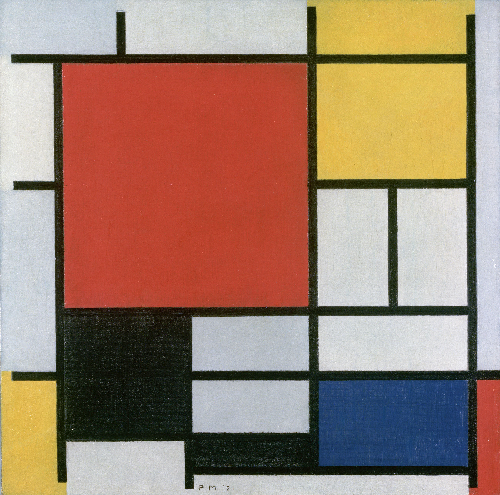

## 基本信息

- 作者：[[蒙德里安 Piet Mondrian]]
- 创作年代：1921
- 材质：(*not from wiki*：布面油画)
- 尺寸：(*not from wiki*：约 60 × 50 cm)
- 现存地：(*not from wiki*：海牙市立博物馆)

## 画面与技法

1918 年起 [[新造型主义 Neo-Plasticism]] 程式的早期标准件：黑色直线把画布分割成若干格子，选几个格子填入红、黄、蓝三原色色块——剩下的工作"只是一点点调整，跟做化学试验似的，等待心动那一刹那"。

## 历史背景 (*not from wiki*)

1921 年是蒙德里安"红黄蓝构图"系列正式定型之年。这一程式在此后二十年里被他反复打磨；每一件作品在视觉上彼此相似，但都需要画家手工调整线条粗细位置与色块比例，作为他与"更高级智慧"沟通的密码盘。

## 图片清单

| 编号 | 出自 | 描述 |
|---|---|---|
| 01 | [[084｜蒙德里安：他为什么要画那么多格子？]] | 红、黄、蓝、黑的构图（1921） |

## 出现在

- [[084｜蒙德里安：他为什么要画那么多格子？]]
