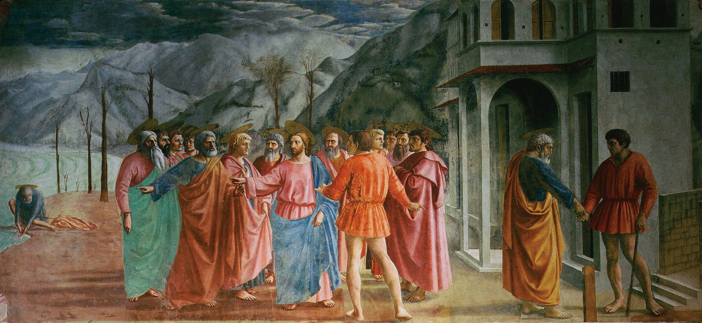
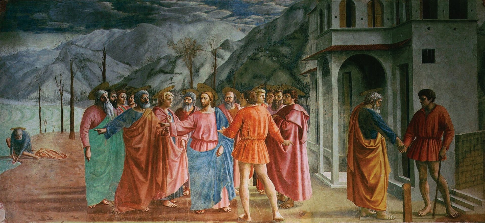

## 基本信息

- 作者：[[马萨乔 Masaccio]]
- 创作年代：约 1425
- 材质：湿壁画 (*not from wiki*)
- 尺寸：255 × 598 cm (*not from wiki*)
- 现存地：佛罗伦萨布兰卡奇礼拜堂 (Cappella Brancacci, Santa Maria del Carmine, Florence) (*not from wiki*)

## 画面与技法

题材：《马太福音》17:24–27，**罗马收税吏**向使徒们索要圣殿税；基督指示彼得**到湖边捕鱼，鱼口含一枚银币**充作税款。同一画面**三段叙事**（左：彼得捕鱼；中：基督与税吏交涉；右：彼得交税）——典型早期文艺复兴**单帧多时连续叙事**。

**顾衡 037 重点**：

- **[[线性透视 Linear Perspective]] 的早期应用**——**近处的房子和远处的山，用以营造景深**
- **湖水也不得不画**——"不然彼得去哪里捕鱼呢？"
- 顾衡用本作论证：**透视法发明之后，为了营造三维空间错觉，风景就不得不被考虑了**——这是[[风景画 Landscape Painting]]作为绘画问题被严肃对待的起点

## 历史背景

(*not from wiki*) 布兰卡奇礼拜堂壁画系列由 Felice Brancacci 委托，[[马萨乔 Masaccio]] 与马索利诺 (Masolino) 合作完成。马萨乔执笔的部分被瓦萨里称为**所有后来佛罗伦萨画家的学校**——米开朗基罗、列奥纳多年轻时都曾来此临摹。

## 图片清单

| 编号 | 出自 | 描述 |
|---|---|---|
| 01 | [[037｜为什么说古典时代没有风景画？]] | 整体图 |

## 出现在

- [[037｜为什么说古典时代没有风景画？]]
