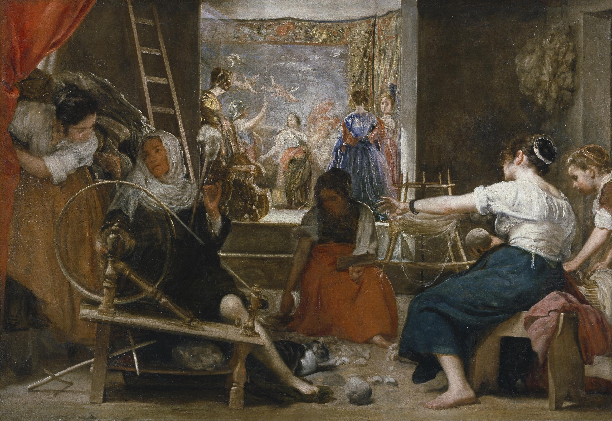

## 基本信息

- 作者：[[委拉斯贵支 Diego Velázquez]]
- 创作年代：1655 年前后
- 材质：布面油画 (*not from wiki*)
- 尺寸：220 × 289 cm (*not from wiki*)
- 现存地：马德里普拉多博物馆 (*not from wiki*)

## 画面与技法

画面中央有一个**转动的纱轮**——这是绘画史上较早通过"模糊化的运动残影"在静态画面上表现运动的范例。1912 年 [[巴拉 Giacomo Balla]] 在构思如何在 [[未来主义 Futurism]] 框架内表现运动时，"这么往前一捯饬，就捯饬到委拉斯贵支那儿了"，据此画出了《[[被拴住的狗的动态 Dynamism of a Dog on a Leash]]》。

## 历史背景

(*not from wiki*) 又名《阿拉克涅的寓言》(*The Fable of Arachne*)，取材奥维德《变形记》——背景墙上挂着提香《劫掠欧罗巴》的复制画作为画中画。属于委拉斯贵支晚期"画中画"系列。

## 图片清单

| 编号 | 出自 | 描述 |
|---|---|---|
| 01 | [[080｜什么是未来主义？]] | 整体图，前景两位女工与转动的纱轮 |

## 出现在

- [[080｜什么是未来主义？]]
