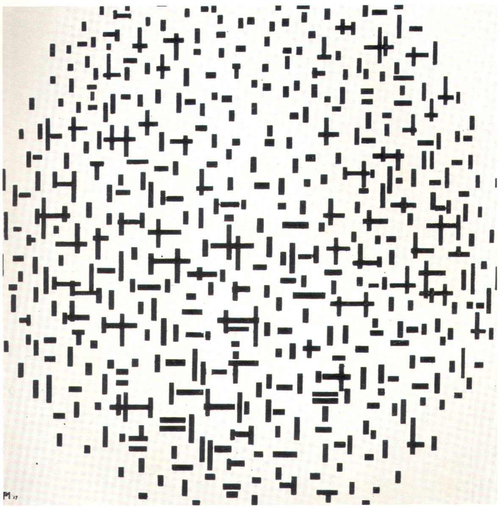

## 基本信息

- 作者：[[蒙德里安 Piet Mondrian]]
- 创作年代：1916–1917
- 材质：(*not from wiki*：布面油画)
- 尺寸：(*not from wiki*：约 108 × 108 cm，方画布)
- 现存地：(*not from wiki*：奥特罗 Kröller-Müller Museum)

## 画面与技法

紧接 [[海堤与海 构成十号 (蒙德里安) Composition No. 10 Pier and Ocean]]，依然是密集的横竖短线条，但完全剥离了任何具象指代——色彩压缩到黑白，标题也只剩"线条"。

## 历史背景 (*not from wiki*)

属于蒙德里安风格转折点上的关键之作；此后他将进一步收紧造型语言，最终在 1918 年走到"黑色直线分割画布 + 红黄蓝色块"的 [[新造型主义 Neo-Plasticism]] 程式。

## 图片清单

| 编号 | 出自 | 描述 |
|---|---|---|
| 01 | [[084｜蒙德里安：他为什么要画那么多格子？]] | 线条构图（黑白中的构图）（1916–1917） |

## 出现在

- [[084｜蒙德里安：他为什么要画那么多格子？]]
