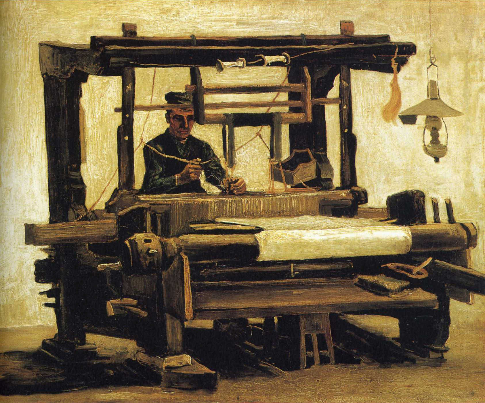

## 基本信息

- 作者：[[凡·高 Vincent van Gogh]]
- 创作年代：1884
- 材质：布面油画 (*not from wiki*)
- 尺寸：—
- 现存地：—

## 画面与技法

凡·高 1884 年在纽南（Nuenen）时期的"织工"系列之一，正面取景版本。057 中与《花田》并列作为凡·高在海牙—纽南时期"进步很快"的证据。

## 历史背景 (*not from wiki*)

凡·高 1883 年底搬到父母任牧师的纽南后，集中创作了一系列织工像（约 30 幅），关注当地手工织布工人这一即将被工业纺织业淘汰的群体——与 [[米勒 Jean-François Millet]] 农民母题一脉相承，并为 1885 年 [[吃土豆的人 The Potato Eaters]] 做铺垫。

## 图片清单

| 编号 | 出自 | 描述 |
|---|---|---|
| 01 | [[057｜凡·高1：为什么说他"性格决定命运"？]] | 凡·高 1884 年《织工》正面取景版本 |

## 出现在

- [[057｜凡·高1：为什么说他"性格决定命运"？]]
