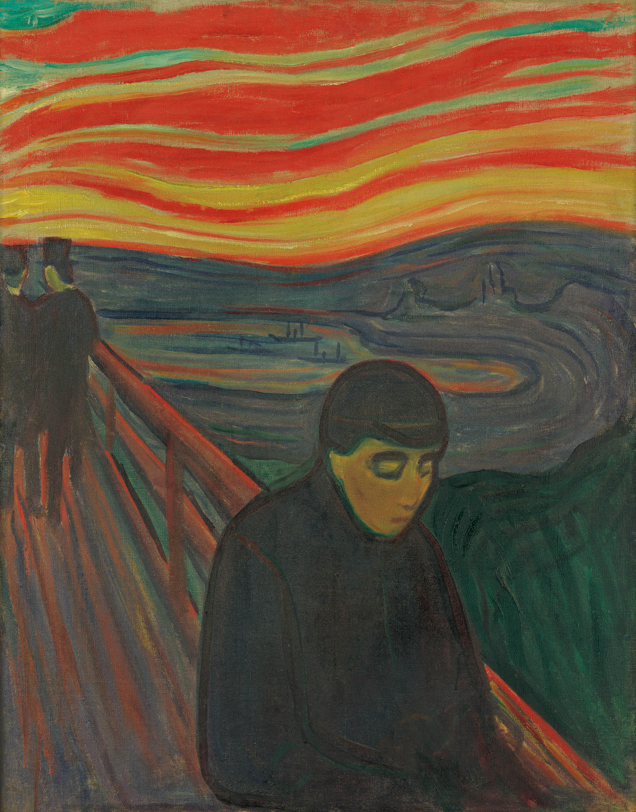
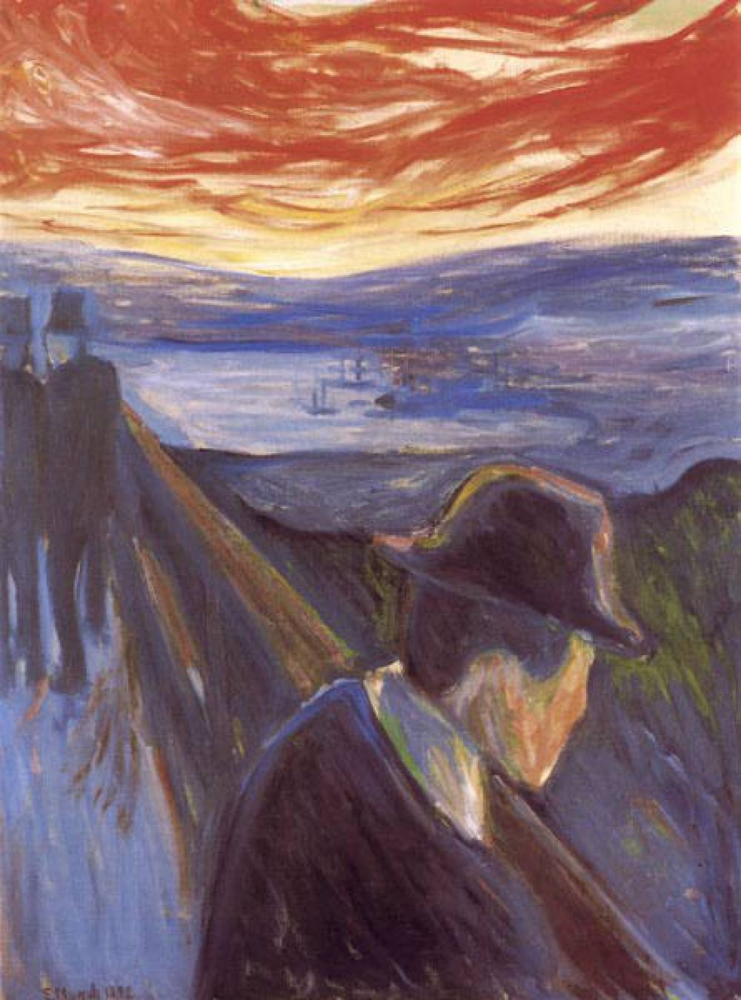

## 基本信息

- 作者：[[爱德华·蒙克 Edvard Munch]]
- 创作年代：1892–1893（两版本）
- 材质：布面油画 (*not from wiki*)
- 尺寸：未注明
- 现存地：未注明

## 画面与技法

[[爱组画 The Frieze of Life]] 六联画之一，**与 [[呐喊 The Scream]] 表现出很高的同质性**——蒙克情感**符号化、公式化**的努力的延伸（顾衡 070）。

主程式：**斜向栏杆 + 血色云 + 前景孤独人形**——但人形不再像呐喊主体那样张嘴尖叫，而是低头、转身、背对观者——绝望由"喊出"变为"闭上嘴的下沉"。

顾衡 070 raw 中本作给出**两幅图**，皆标 1892–1893 年代——一为竖构图站立人物，一为另一构图变体——蒙克在同一主题反复试验。

## 历史背景 (*not from wiki*)

本作在时间上**早于** [[呐喊 The Scream]]——一般被视为呐喊的"前身"或"草图阶段"，桥接 1892 蒙克在柏林展出的所谓**"蒙克丑闻"**事件（柏林分离派由此而生）与 1893 年呐喊定稿。

## 图片清单

| 编号 | 出自 | 描述 |
|---|---|---|
| 01 | [[070｜蒙克1：表现主义的先行者经历了什么？]] | 绝望 1892–1893 — 构图 A |
| 02 | [[070｜蒙克1：表现主义的先行者经历了什么？]] | 绝望 1892–1893 — 构图 B |

## 出现在

- [[070｜蒙克1：表现主义的先行者经历了什么？]]
