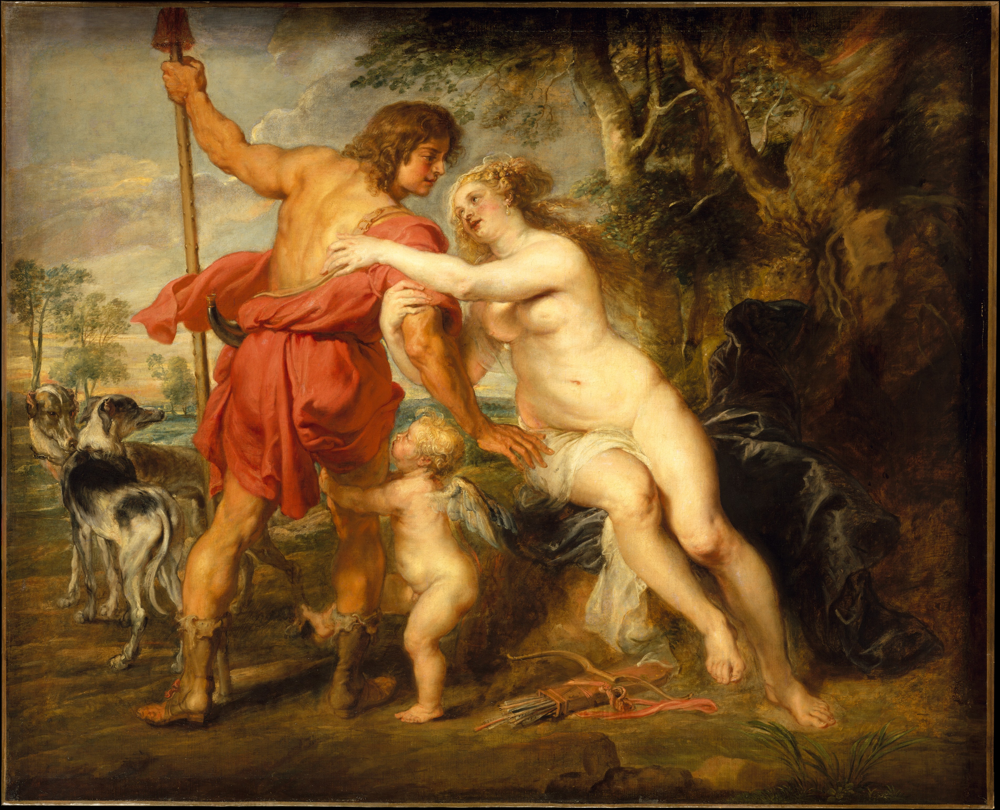

## 基本信息

- 作者：[[鲁本斯 Peter Paul Rubens]]
- 创作年代：约 1630
- 材质：布面油画
- 尺寸：197 × 243 cm (*not from wiki*)
- 现存地：纽约大都会艺术博物馆 (*not from wiki*)

## 画面与技法

维纳斯**正面坐姿**，丘比特抱住阿都尼斯的腿试图挽留；阿都尼斯**朝向画面纵深**（背对观者）正要出门狩猎；身后猎犬群已经躁动。色彩**自由松散**——鲁本斯学提香学得最彻底的部分。

**顾衡对照**（016）：与 [[维纳斯与阿都尼斯 (提香) Venus and Adonis (Titian)]]——
- 同题、同构图基本盘
- 提香：平面叙事，主角向右
- 鲁本斯：纵深叙事，主角向后

这是 [[巴洛克]] 关键转向：**从平面叙事转向纵深叙事**。后续 022–027 详谈。

## 历史背景

(*not from wiki*) 鲁本斯本人在 1628–29 出使马德里时曾长期临摹提香《Poesie》系列；此作直接致敬普拉多藏的提香版本，但加入了丘比特和向纵深的运动——鲁本斯把提香的诗意改造成巴洛克的戏剧。

## 图片清单

| 编号 | 出自 | 描述 |
|---|---|---|
| 01 | [[016｜提香：为什么业界评价比达芬奇还高？]] | 整体图 |

## 出现在

- [[016｜提香：为什么业界评价比达芬奇还高？]]
