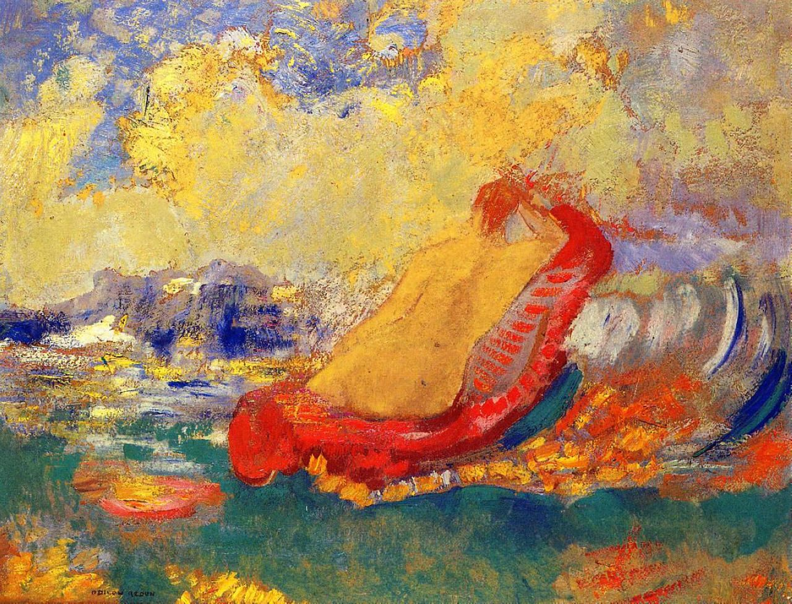

## 基本信息

- 作者：[[雷东 Odilon Redon]]
- 创作年代：1910
- 材质：年代不详（雷东晚期粉彩 / 油彩）
- 尺寸：年代不详
- 现存地：未注明

## 画面与技法

雷东晚期对 [[维纳斯的诞生 The Birth of Venus]]（[[波蒂切利 Botticelli]] 经典母题）的**梦境式重写**：饱和色彩、模糊形状、叙事元素弱化。

## 历史背景 (*not from wiki*)

与 [[波蒂切利 Botticelli]] 1485 年的同名画 ([[维纳斯的诞生 The Birth of Venus]]) 和 [[卡巴内尔 Alexandre Cabanel]] 1863 年的学院派版 ([[维纳斯的诞生 (卡巴内尔) The Birth of Venus (Cabanel)]]) 构成有趣的对位——同一母题在文艺复兴、学院派、象征主义三种语境下被反复改写，雷东版本是其中最**远离写实再现**的一支。

## 图片清单

| 编号 | 出自 | 描述 |
|---|---|---|
| 01 | [[051｜雷东：怪诞是不是象征主义的方向？]] | 雷东 1910 版 |

## 出现在

- [[051｜雷东：怪诞是不是象征主义的方向？]]
