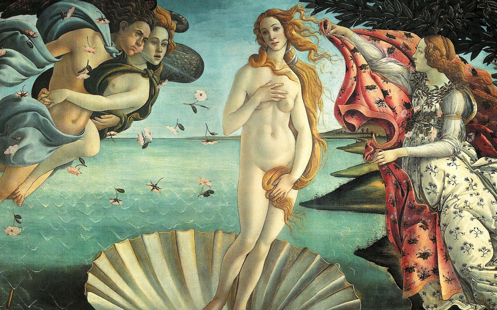

## 基本信息

- 作者：[[波蒂切利 Botticelli]]
- 创作年代：1477 / 1485 (顾衡引 1477；学界主流 1484–1486) (*not from wiki*)
- 材质：布面蛋彩（罕见——大部分文艺复兴板画用木板，这是早期油 / 蛋彩 + 大型布面之一）
- 尺寸：172.5 × 278.9 cm (*not from wiki*)
- 现存地：佛罗伦萨乌菲齐美术馆 (Galleria degli Uffizi)

## 画面与技法

中央：刚刚诞生的**全身赤裸的维纳斯**站在一个巨大贝壳上，**S 造型**——长金发遮住小腹与右胸，左手遮另一胸（[[用手遮挡私处母题 Venus pudica]]）。

- **左**：西风神 泽费罗斯 + 西风女神 奥拉 (拥抱着泽费罗斯)——向维纳斯吹送春风，从口中抛洒花瓣；
- **右**：海洋女神 / 时序女神 殷勤张开披风迎接维纳斯靠岸；
- **背景**：塞浦路斯帕福斯海岸的蓝色海面。

题材出自洛伦佐门客、诗人 安杰罗·波利齐亚诺 的诗：
> 她航行在白色波涛的海面上 / 一个超过人类面貌的年轻贞女 / 强壮的西风之神将她吹向塞浦路斯海岸 / 在蓝天下，她出生的贝壳里

**艺术史意义**——古罗马衰亡后**全身赤裸的古希腊女神形象第一次回到欧洲画面**——也是基督教文明中的第一次。这只有在 [[新柏拉图主义 Neoplatonism]] / [[费奇诺 Marsilio Ficino]] 的整合下才能在教会赞助语境中合法化：维纳斯不再是异教神，而是"理念美的化身"。

模特：**西蒙内塔·维斯普奇**（佛罗伦萨第一美女，1476 年 23 岁早逝，洛伦佐弟弟朱利亚诺的恋人）。本画作于美人离世 8–9 年后，是 朱利亚诺·美第奇 为悼念恋人订制系列的一部分。

## 历史背景

(*not from wiki*) 原藏地至今争议未决；最早可考的记录是 1550 年瓦萨里在 *Vite* 中提到这幅画与 [[春 La Primavera]] 一起挂在维勒 di Castello（美第奇家族别墅）。

## 图片清单

| 编号 | 出自 | 描述 |
|---|---|---|
| 01 | [[009｜波蒂切利：如何解读"理念美"？]] | 整体图 |

## 出现在

- [[009｜波蒂切利：如何解读"理念美"？]]
