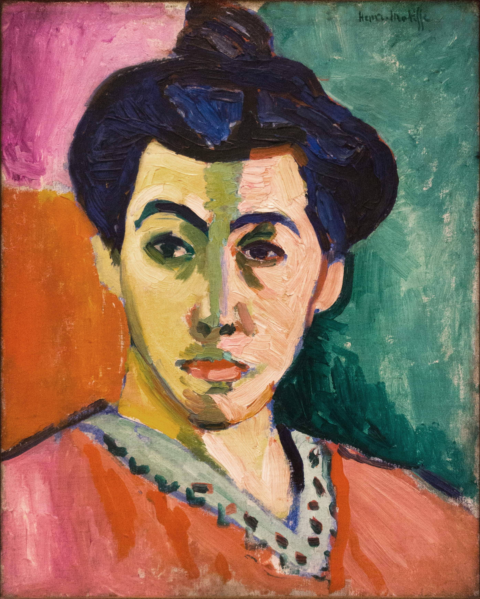

## 基本信息

- 作者：[[马蒂斯 Henri Matisse]]
- 创作年代：1905
- 材质：布面油画 (*not from wiki*)
- 尺寸：约 40.5 × 32.5 cm (*not from wiki*)
- 现存地：丹麦哥本哈根国立美术馆 (Statens Museum for Kunst, Copenhagen) (*not from wiki*)

## 画面与技法

[[马蒂斯 Henri Matisse]] 夫人 Amélie 的肖像。画面被一道刷在鼻梁处的、蛮横而突兀的**绿色垂直条带**纵向劈成两半——左侧黄绿、右侧粉红——背景则被切为红、绿、紫橙三块色域。

技法要点：

- **绿线作为构图骨架**：这条绿色不是阴影，也不是写实意义上的颜色——它是 [[马蒂斯 Henri Matisse]] 引入的、显化 [[塞尚 Paul Cézanne]] "**分节** (passage)" 概念的手段。马蒂斯说："如果塞尚是对的，那么我也是对的。塞尚的作品中存在着关于结构的法则。"
- **平面化、放弃纵深**：画面背景被三块**纯色色域**分割，没有任何空间退缩的暗示——与 [[高更 Paul Gauguin]] 的 [[黄色的基督 The Yellow Christ]] 那种"用色值暗示纵深"的做法明确决裂。一旦放弃纵深，色彩选择就获得彻底自由。
- **保留 [[塞尚 Paul Cézanne]] 的笔触**：与高更勾边大平涂不同，可见的笔触是马蒂斯路线的核心。

[[德朗 André Derain]] 后来为 [[野兽派 Fauvism]] 提出口号"**为色彩而色彩**"——本画是该口号的样板。

## 历史背景 (*not from wiki*)

- 创作于 1905 年秋，同年与 [[戴帽子的女人 Woman with a Hat]] 一起进入野兽派的代表作行列。
- 长期以来被视作野兽派最干净利落的纲领性肖像。

## 图片清单

| 编号 | 出自 | 描述 |
|---|---|---|
| 01 | [[061｜马蒂斯2：为什么说野兽派不"野兽"？]] | 整幅画面 |

## 出现在

- [[061｜马蒂斯2：为什么说野兽派不"野兽"？]] —— 用来说明野兽派与综合主义在"是否暗示纵深"上的根本区别
